# UrbanSneakers

> E-commerce full stack de zapatillas deportivas con catálogo, carrito persistente, autenticación por sesión, pagos con Stripe, facturación PDF y panel de gestión basado en roles.


UrbanSneakers reproduce el ciclo principal de una tienda online: descubrimiento de producto, selección de variantes, carrito, identificación del cliente, captura de la dirección de envío, pago externo seguro, preparación del pedido y descarga de factura.

El proyecto está construido sin un framework de frontend para mostrar el dominio de JavaScript y de la comunicación HTTP, mientras que el backend concentra la seguridad, las reglas de negocio y la persistencia. El resultado es una aplicación modular, con responsabilidades separadas y preparada para evolucionar hacia un despliegue real.

## Índice

- [Vista de la aplicación](#vista-de-la-aplicación)
- [Funcionalidades](#funcionalidades)
- [Arquitectura](#arquitectura)
- [Flujo de compra y pago](#flujo-de-compra-y-pago)
- [Modelo de datos](#modelo-de-datos)
- [Decisiones técnicas](#decisiones-técnicas)
- [Backend: clases Java](#backend-clases-java)
- [Frontend](#frontend)
- [API REST](#api-rest)
- [Seguridad y permisos](#seguridad-y-permisos)
- [Ejecución local](#ejecución-local)
- [Pruebas](#pruebas)
- [Evolución prevista](#evolución-prevista)

## Vista de la aplicación

Las rutas de las siguientes capturas ya están preparadas. Al guardar las imágenes con esos nombres dentro de `imgReadme/`, GitHub las mostrará automáticamente.

### Catálogo

<!-- Catálogo -->
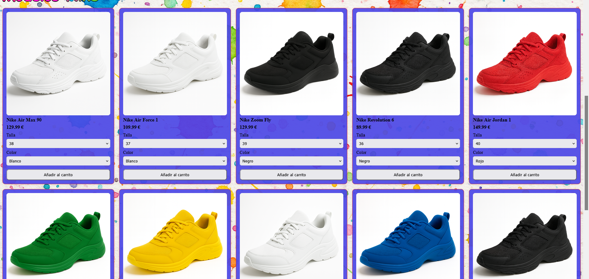

### Carrito y proceso de compra

<!-- Carrito -->
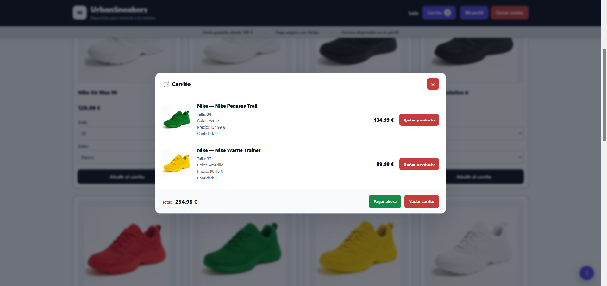

<!-- Checkout de stripe-->
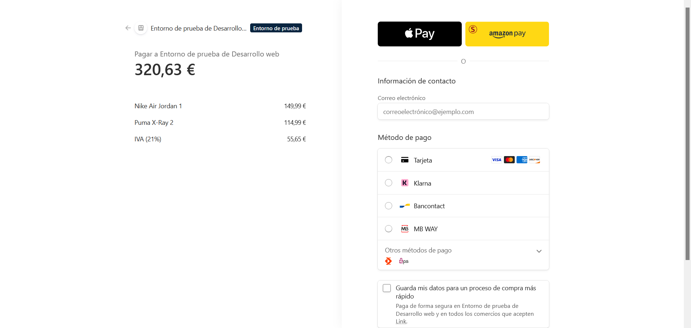

### Área privada del cliente

<!-- Perfil y configuración -->
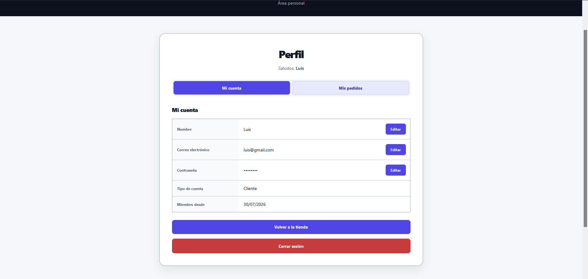

<!-- Perfil y pedidos -->
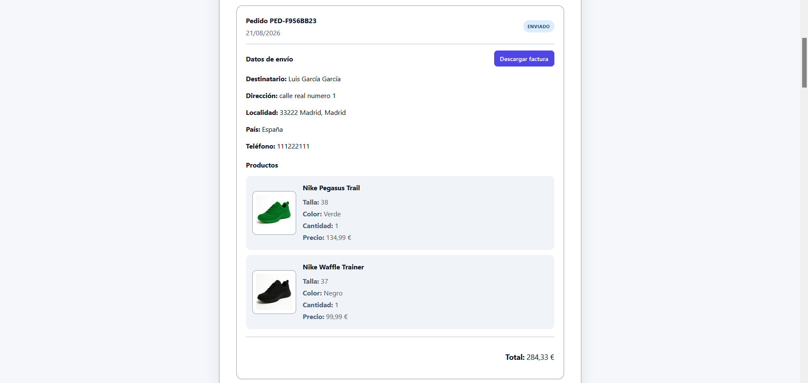

### Panel de gestión

<!-- Panel control -->
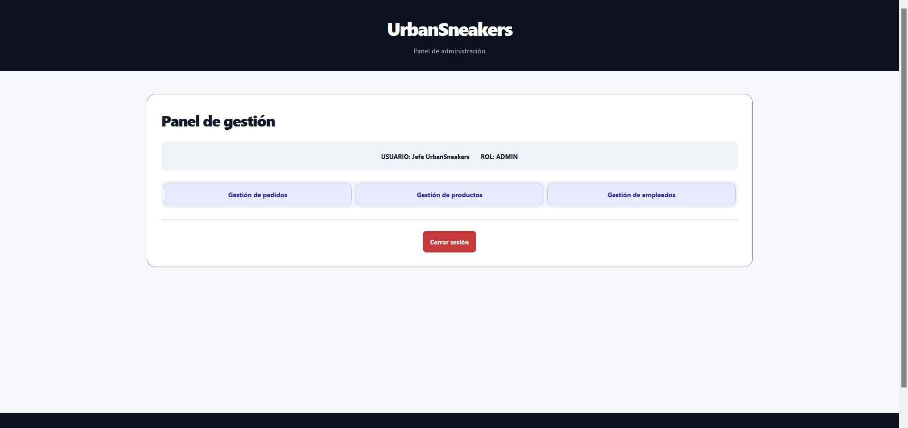

<!-- Pedidos -->
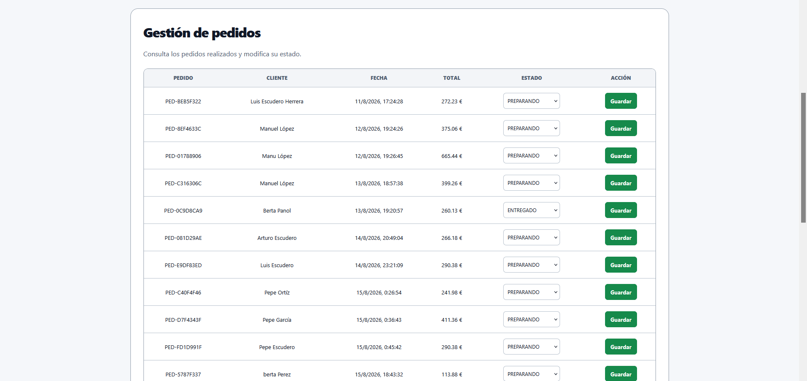

<!-- Productos registrados -->
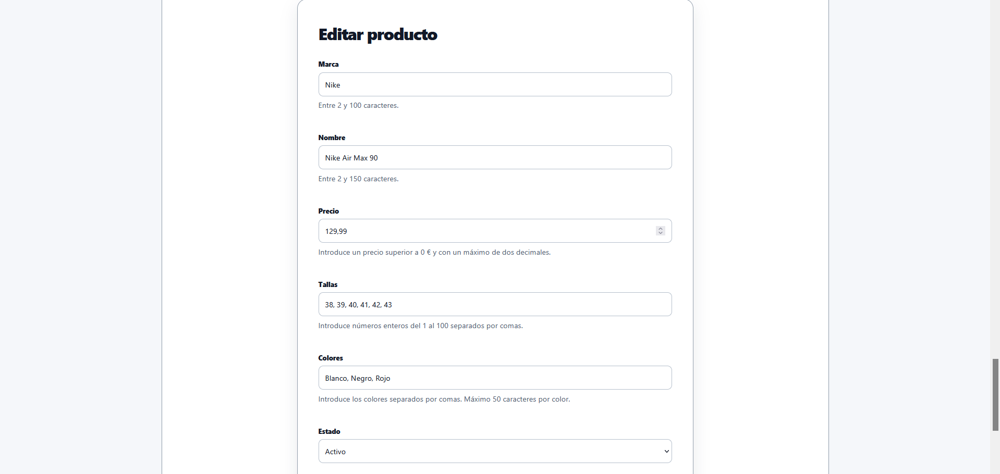

<!-- Productos editar -->
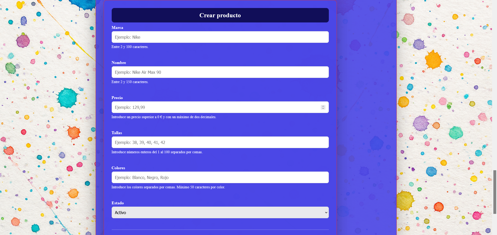

<!-- Empleados -->
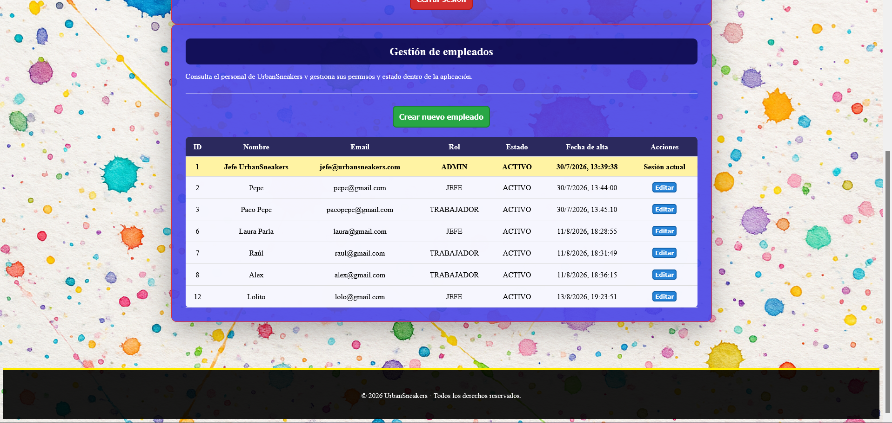

<!-- Empleados -->
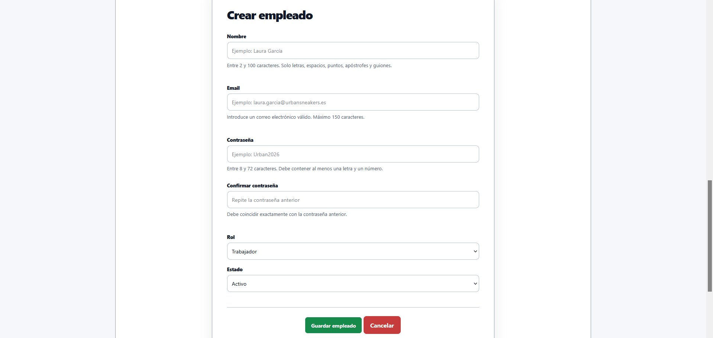

## Funcionalidades

### Experiencia de cliente

- Catálogo dinámico de zapatillas, organizado por marcas.
- Selección de talla, color y cantidad.
- Imágenes específicas para las variantes de color.
- Carrito asociado al usuario y persistido en MariaDB.
- Registro, inicio de sesión, consulta de sesión y cierre de sesión.
- Checkout con validación de los datos de envío y aceptación de términos.
- Pago mediante una sesión alojada de Stripe Checkout.
- Consulta del historial y detalle de los pedidos propios.
- Actualización de nombre, correo electrónico y contraseña.
- Descarga de facturas en PDF para pedidos pagados.
- Notificaciones visuales y diseño responsive.
- Páginas de términos, privacidad y cookies.

### Operativa interna

- Listado y cambio del estado de los pedidos.
- Historial auditable de los cambios de estado y del usuario que los realiza.
- Alta, edición y activación de productos.
- Alta, edición y activación de empleados.
- Permisos distintos para `TRABAJADOR`, `JEFE` y `ADMIN`.

### Reglas de negocio implementadas

| Regla | Implementación |
|---|---|
| Fuente de precios | El backend recupera el producto y calcula los importes; no confía en el precio enviado por el navegador. |
| IVA | 21 % calculado con `BigDecimal`. |
| Envío | Gratuito desde 100 € de subtotal; 4,99 € en pedidos inferiores. |
| Identificador público | Código con formato `PED-XXXXXXXX`, independiente del identificador interno de base de datos. |
| Estado inicial | Pedido y pago se crean como `PENDIENTE`. |
| Pago confirmado | El webhook firmado de Stripe cambia el pago a `PAGADO` y el pedido a `PREPARANDO`. |
| Factura | Se crea tras confirmar el pago y se genera en PDF bajo demanda. |
| Conservación histórica | Cada línea del pedido guarda una copia del nombre, talla, color, cantidad y precio de compra. |

## Arquitectura

La aplicación sigue una arquitectura cliente-servidor y, dentro del backend, una separación por capas:

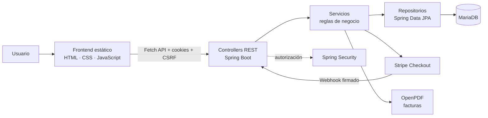

| Capa | Responsabilidad |
|---|---|
| Presentación | Renderiza la tienda, el perfil y el panel; gestiona la interacción y consume la API mediante `fetch`. |
| Controladores | Definen el contrato HTTP, aplican validación de entrada y delegan la operación. |
| Servicios | Ejecutan casos de uso, cálculos, transacciones y coordinación entre entidades e integraciones. |
| Seguridad | Autentica por correo y contraseña, mantiene la sesión y autoriza por rol. |
| Persistencia | Abstrae el acceso a MariaDB mediante repositorios JPA. |
| Integraciones | Stripe procesa el pago; OpenPDF construye la factura descargable. |

### Estructura del repositorio

```text
.
├── backend/
│   ├── pom.xml
│   └── src/
│       ├── main/
│       │   ├── java/com/tiendadeportivas/backend/
│       │   │   ├── config/
│       │   │   ├── controller/
│       │   │   ├── exception/
│       │   │   ├── model/
│       │   │   ├── repository/
│       │   │   ├── security/
│       │   │   └── service/
│       │   └── resources/
│       └── test/
├── frontend/
│   ├── css/
│   ├── img/
│   ├── js/
│   ├── legal/
│   ├── panel/
│   ├── usuario/
│   └── tienda.html
├── docs/
│   └── seguridad.md
└── imgReadme/
```

La carpeta `docs/` reúne la documentación técnica utilizada durante el proceso de validación y profesionalización de UrbanSneakers. Actualmente contiene la documentación del único bloque validado, el [Bloque 1 — Seguridad inmediata](docs/seguridad.md). A medida que los siguientes bloques técnicos sean revisados y validados, se incorporarán progresivamente sus documentos correspondientes.

## Flujo de compra y pago

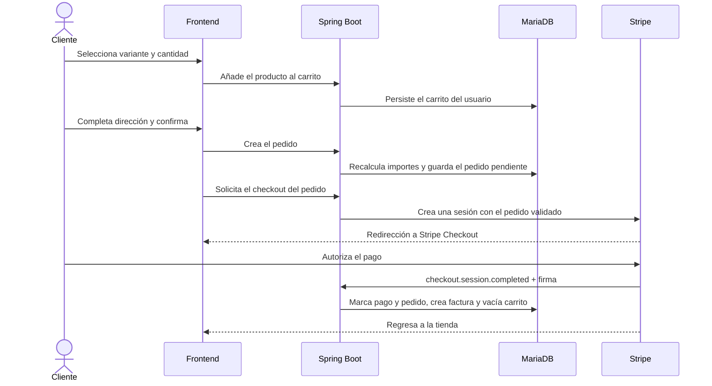

La redirección del navegador no se considera una prueba de pago. La confirmación efectiva llega de servidor a servidor mediante el webhook de Stripe, cuya firma se valida antes de modificar el pedido. El procesamiento comprueba además la sesión asociada y el estado actual para que una repetición del evento no duplique la confirmación.

## Modelo de datos

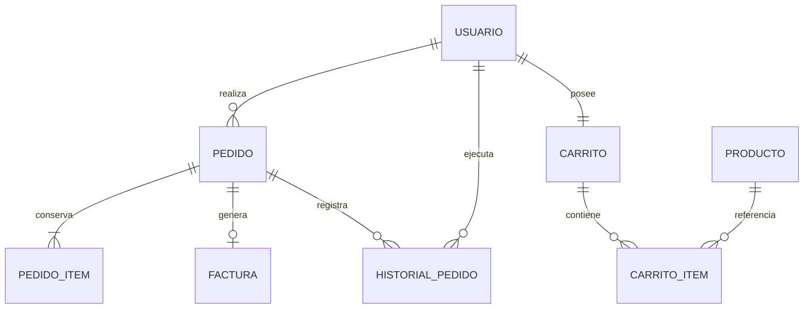

- `CarritoItem` referencia el producto actual y evita duplicar una misma combinación de carrito, producto, talla y color.
- `PedidoItem` funciona como una instantánea: protege la integridad histórica aunque después cambie el catálogo.
- `Factura` mantiene una relación única con el pedido.
- `HistorialPedido` registra estado anterior, estado nuevo, fecha y usuario responsable.
- Los importes monetarios se almacenan con precisión decimal, evitando los errores propios de `float` o `double`.

## Decisiones técnicas

### Backend como fuente de verdad

El navegador envía intención de compra, no importes fiables. Los servicios recuperan productos, validan cantidades y vuelven a calcular subtotal, IVA, envío y total antes de persistir o crear una sesión de pago.

### Autenticación de sesión frente a JWT

Para una aplicación web del mismo dominio funcional se eligió una sesión administrada por Spring Security. Esto simplifica la revocación mediante logout, evita almacenar tokens de acceso en JavaScript y permite usar la cookie `JSESSIONID` con `HttpOnly`. Las peticiones que cambian estado incorporan protección CSRF.

### Checkout alojado y webhook firmado

Los datos sensibles de tarjeta se introducen en Stripe Checkout y no atraviesan la aplicación. El webhook es la autoridad final sobre el resultado del pago; su firma se verifica con `STRIPE_WEBHOOK_SECRET`.

### Carrito persistente

El carrito vive en la base de datos y está vinculado uno a uno con el cliente. Así puede recuperarse tras recargar la página o iniciar una nueva sesión, y el servidor conserva el control de las variantes y cantidades.

### Separación entre entidades y respuestas

Los DTO de entrada y salida delimitan lo que acepta o expone la API. Esto evita devolver accidentalmente campos sensibles —como el hash de contraseña— y desacopla parte del contrato HTTP del modelo persistente.

### Integridad histórica del pedido

Las líneas del pedido no dependen del precio futuro del producto. Al comprar se guarda una instantánea de los datos comerciales necesarios, una decisión esencial para pedidos, devoluciones y facturación.

### Configuración segura y orientada a entornos

Las claves de Stripe se inyectan mediante variables de entorno. La configuración actual está orientada a desarrollo local (`localhost`, HTTP y actualización automática del esquema); un despliegue de producción debe usar perfiles, HTTPS, migraciones versionadas y secretos administrados.

## Backend: clases Java

### Arranque y configuración

| Clase | Responsabilidad |
|---|---|
| `BackendApplication` | Punto de entrada de Spring Boot. |
| `SecurityConfig` | Configura BCrypt, autenticación, autorización por rutas, CSRF, CORS y cookies de sesión. |
| `StripeConfig` | Inicializa el SDK de Stripe con la clave recibida desde el entorno. |
| `DatosInicialesConfig` | Carga el catálogo inicial desde JSON cuando la tabla de productos está vacía. |

### Controladores REST

| Clase | Responsabilidad |
|---|---|
| `AuthController` | Registro, login, consulta del usuario autenticado, entrega del token CSRF y logout. |
| `ProductoController` | Expone el catálogo público de productos activos. |
| `CarritoController` | Consulta, alta, eliminación y vaciado de líneas del carrito autenticado. |
| `PedidoController` | Calcula el resumen y crea pedidos para el cliente conectado. |
| `ClienteController` | Gestiona el perfil, pedidos propios y descarga segura de facturas. |
| `StripeController` | Crea sesiones de Stripe Checkout; incluye el flujo basado en un pedido ya persistido. |
| `StripeWebhookController` | Recibe eventos de Stripe, verifica su firma y coordina la confirmación de pagos. |
| `AdminPedidoController` | Lista pedidos y permite actualizar su estado desde el panel interno. |
| `AdminProductoController` | Gestiona el alta y la edición del catálogo. |
| `AdminUsuarioController` | Gestiona las cuentas y roles del personal autorizado. |
| `AdminPerfilController` | Gestiona el nombre, email y contraseña propios del personal autenticado. |
| `SaludoController` | Endpoint sencillo de comprobación de la API. |

### Servicios de negocio

| Clase | Responsabilidad |
|---|---|
| `UsuarioService` | Registro y mantenimiento de clientes y empleados, validación de credenciales y reglas de roles. |
| `ProductoService` | Consulta, creación, edición y validación de productos. |
| `CarritoService` | Crea o recupera el carrito, consolida variantes y controla sus líneas. |
| `PedidoService` | Construye pedidos, calcula importes, consulta pedidos y registra cambios de estado. |
| `StripeService` | Traduce carritos o pedidos validados a sesiones y líneas de Stripe Checkout. |
| `FacturaService` | Crea numeraciones de factura, comprueba la propiedad del pedido y coordina la descarga. |
| `FacturaPdfService` | Compone el documento PDF con datos del cliente, líneas e importes. |

### Persistencia

Los repositorios `UsuarioRepository`, `ProductoRepository`, `CarritoRepository`, `CarritoItemRepository`, `PedidoRepository`, `PedidoItemRepository`, `FacturaRepository` e `HistorialPedidoRepository` extienden Spring Data JPA. Centralizan consultas derivadas y mantienen los servicios independientes de SQL específico.

### Seguridad y tratamiento de errores

| Clase | Responsabilidad |
|---|---|
| `CustomUserDetailsService` | Busca al usuario por correo y lo adapta al modelo de autenticación de Spring Security. |
| `GlobalExceptionHandler` | Convierte errores de seguridad, negocio y validación en respuestas HTTP coherentes. |

### Entidades, enumeraciones y DTO

| Grupo | Clases |
|---|---|
| Entidades JPA | `Usuario`, `Producto`, `Carrito`, `CarritoItem`, `Pedido`, `PedidoItem`, `Factura`, `HistorialPedido`. |
| Estados y roles | `RolUsuario`, `EstadoPedido`, `EstadoPago`. |
| Entrada de autenticación | `RegistroUsuarioRequest`, `LoginRequest`. |
| Entrada de cliente | `ActualizarNombreClienteRequest`, `ActualizarEmailClienteRequest`, `ActualizarPasswordClienteRequest`. |
| Entrada de personal | `ActualizarEmailPersonalRequest`, `ActualizarPasswordPersonalRequest`. |
| Entrada de compra | `CarritoItemRequest`, `PedidoRequest`. |
| Entrada de administración | `ProductoRequest`, `CambioEstadoPedidoRequest`, `CrearEmpleadoRequest`, `ActualizarEmpleadoRequest`. |
| Respuestas | `UsuarioRespuesta`, `EmpleadoRespuesta`, `CarritoItemRespuesta`, `PedidoResumen`, `PedidoAdminResumen`, `CambioEstadoPedidoRespuesta`, `PedidoClienteRespuesta`, `PedidoItemClienteRespuesta`. |
| Apoyo | `Saludo`, usado por el endpoint básico de verificación. |

## Frontend

El frontend utiliza módulos JavaScript por responsabilidad y una API común:

| Archivo o área | Responsabilidad |
|---|---|
| `frontend/tienda.html` | Página principal: catálogo, carrito y checkout. |
| `frontend/js/api.js` | URL base, peticiones con credenciales y gestión del token CSRF. |
| `frontend/js/catalogo.js` y `productos.js` | Carga, filtrado y presentación de productos y variantes. |
| `frontend/js/carrito.js` | Estado visual del carrito y sincronización con el backend. |
| `frontend/js/checkout.js` | Validación, creación de pedido e inicio del pago. |
| `frontend/js/usuario.js` | Estado de sesión y adaptación de la interfaz al usuario. |
| `frontend/usuario/` | Registro, login, perfil, pedidos y facturas. |
| `frontend/panel/` | Gestión interna de pedidos, productos y empleados. |
| `frontend/legal/` | Información de términos, privacidad y cookies. |

## API REST

Resumen de los principales endpoints:

| Método | Ruta | Acceso | Finalidad |
|---|---|---|---|
| `POST` | `/auth/registro` | Público | Registrar un cliente. |
| `POST` | `/auth/login` | Público | Autenticar y crear la sesión. |
| `GET` | `/auth/me` | Autenticado | Consultar el usuario actual. |
| `GET` | `/auth/csrf` | Público | Obtener la cookie y el token CSRF. |
| `POST` | `/auth/logout` | Autenticado | Invalidar la sesión. |
| `GET` | `/productos` | Público | Obtener productos activos. |
| `GET` | `/carrito` | Cliente | Consultar el carrito. |
| `POST` | `/carrito` | Cliente | Añadir o incrementar una variante. |
| `DELETE` | `/carrito` | Cliente | Eliminar una variante. |
| `DELETE` | `/carrito/todo` | Cliente | Vaciar el carrito. |
| `GET` | `/pedido/resumen` | Cliente | Obtener totales calculados por el servidor. |
| `POST` | `/pedido` | Cliente | Validar el checkout y crear el pedido. |
| `POST` | `/api/stripe/checkout/pedido` | Cliente | Crear la sesión de pago del pedido. |
| `POST` | `/api/stripe/webhook` | Stripe/firma | Confirmar eventos de pago. |
| `GET` | `/cliente/perfil/pedidos` | Cliente | Consultar los pedidos propios. |
| `GET` | `/cliente/perfil/pedidos/{idPedido}/factura` | Cliente propietario | Descargar la factura PDF. |
| `PUT` | `/cliente/perfil/nombre` | Cliente | Actualizar el nombre. |
| `PUT` | `/cliente/perfil/email` | Cliente | Actualizar el correo. |
| `PUT` | `/cliente/perfil/password` | Cliente | Cambiar la contraseña. |
| `PUT` | `/admin/mi-cuenta/nombre` | Personal | Actualizar el nombre propio. |
| `PUT` | `/admin/mi-cuenta/email` | Personal | Actualizar el email propio y cerrar la sesión. |
| `PUT` | `/admin/mi-password` | Personal | Cambiar la contraseña propia. |
| `GET` | `/admin/pedidos` | Personal | Listar pedidos. |
| `PATCH` | `/admin/pedidos/{id}/estado` | Personal | Cambiar el estado del pedido. |
| `GET/POST` | `/admin/productos` | Personal | Listar o crear productos. |
| `PUT` | `/admin/productos/{id}` | Personal | Editar un producto. |
| `GET/POST` | `/admin/usuarios` | Jefe/Admin | Listar o crear empleados. |
| `PUT` | `/admin/usuarios/{id}` | Jefe/Admin | Editar un empleado. |

## Seguridad y permisos

UrbanSneakers aplica Spring Security sobre sesiones HTTP y separa el acceso mediante los roles `CLIENTE`, `TRABAJADOR`, `JEFE` y `ADMIN`. Cada familia de endpoints declara sus roles permitidos y la configuración termina con `anyRequest().denyAll()`: cualquier ruta que no haya sido clasificada expresamente queda bloqueada.

- Contraseñas almacenadas con BCrypt mediante `PasswordEncoder`.
- Autenticación de sesión con `JSESSIONID`, `SecurityContext` y protección frente a session fixation mediante `changeSessionId()`.
- Registro de sesiones en `SessionRegistry` y expiración cuando cambia el rol de un empleado o su cuenta pasa de activa a inactiva.
- Protección CSRF con token en cookie para las operaciones con cambio de estado; el webhook queda excluido porque Stripe lo invoca externamente.
- CORS limitado en desarrollo a `localhost:5500` y `127.0.0.1:5500`, con credenciales habilitadas.
- Cambio de contraseña propia sujeto a la comprobación de la contraseña actual mediante `PasswordEncoder.matches()`.
- Cambio de email propio sujeto a la misma comprobación e invalidación posterior de la sesión desde el backend.
- DTOs de entrada y respuesta que limitan los campos aceptados y evitan exponer entidades completas cuando no son necesarias.
- Construcción segura del DOM con `createElement`, `textContent` y propiedades DOM en catálogo, carrito, checkout, perfil y panel.
- Verificación del encabezado `Stripe-Signature` mediante `Webhook.constructEvent()` antes de procesar un webhook.
- Gestión estándar de errores sin incluir stack traces, excepciones, binding errors ni mensajes internos.

### Flujo de autenticación segura

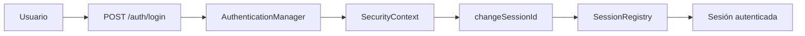

### Acceso por nivel

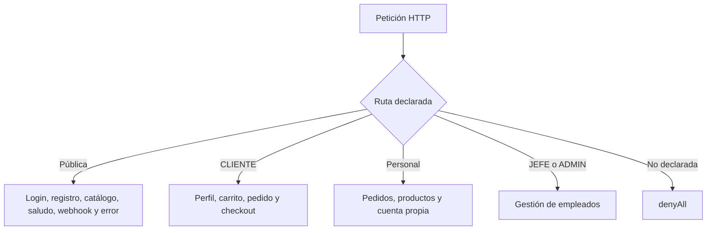

| Recurso | CLIENTE | TRABAJADOR | JEFE | ADMIN |
|---|:---:|:---:|:---:|:---:|
| Carrito, checkout y perfil propio | Sí | No | No | No |
| Gestión de pedidos | No | Sí | Sí | Sí |
| Gestión de productos | No | Sí | Sí | Sí |
| Gestión de empleados | No | No | Sí | Sí |

Los cambios propios del personal solo aceptan nombre, email y contraseña; el rol y el estado no forman parte de esos DTOs. El cambio administrativo de rol o la desactivación de otra cuenta provoca la expiración de sus sesiones registradas.

La documentación detallada de las medidas, pruebas manuales y dos auditorías del primer bloque se encuentra en [docs/seguridad.md](docs/seguridad.md).

> La configuración incluida está pensada para desarrollo local. En producción, la cookie debe usar `Secure`, los orígenes CORS deben restringirse al dominio definitivo y toda la aplicación debe servirse mediante HTTPS.

## Tecnologías

| Área | Tecnología | Uso |
|---|---|---|
| Lenguaje backend | Java 21 | Dominio, API e integraciones. |
| Framework | Spring Boot 4.1.0 | Configuración y ejecución de la aplicación. |
| API | Spring Web | Controladores REST y serialización JSON. |
| Seguridad | Spring Security | Sesión, BCrypt, CSRF, CORS y autorización. |
| Persistencia | Spring Data JPA / Hibernate | Mapeo relacional y repositorios. |
| Base de datos | MariaDB | Persistencia transaccional. |
| Validación | Jakarta Bean Validation | Restricciones en entradas HTTP. |
| Pagos | Stripe Java 33.2.0 | Checkout y webhooks. |
| Documentos | OpenPDF 2.0.3 | Generación de facturas PDF. |
| Build | Maven Wrapper | Build reproducible del backend. |
| Cliente | HTML5, CSS3 y JavaScript ES6 | Interfaz responsive sin framework. |

## Ejecución local

### Requisitos

- JDK 21.
- MariaDB en ejecución.
- Stripe CLI para probar webhooks en local.
- Una cuenta de Stripe en modo de prueba.
- Visual Studio Code con Live Server, o cualquier servidor HTTP estático en el puerto `5500`.

No es necesario instalar Maven globalmente: el repositorio incluye Maven Wrapper.

### 1. Crear la base de datos

```sql
CREATE DATABASE tienda_deportivas
    CHARACTER SET utf8mb4
    COLLATE utf8mb4_unicode_ci;
```

La configuración local por defecto utiliza el usuario `root` sin contraseña. Si tu instalación es diferente, ajusta `backend/src/main/resources/application.properties` o externaliza esas propiedades para tu entorno.

### 2. Configurar Stripe

En la misma terminal de PowerShell desde la que se iniciará Spring Boot:

```powershell
$env:STRIPE_SECRET_KEY="sk_test_..."
$env:STRIPE_WEBHOOK_SECRET="whsec_..."
```

La clave `whsec_...` la proporciona Stripe CLI al iniciar la escucha local. No guardes claves reales en Git.

### 3. Iniciar el backend

```powershell
cd backend
.\mvnw.cmd spring-boot:run
```

La API quedará disponible en `http://localhost:8080`.

### 4. Escuchar los webhooks

En otra terminal:

```powershell
C:\stripe\stripe.exe listen --forward-to localhost:8080/api/stripe/webhook
```

Si Stripe CLI muestra un secreto distinto, actualiza `STRIPE_WEBHOOK_SECRET` y reinicia el backend.

### 5. Servir el frontend

Abre `frontend/tienda.html` con Live Server y comprueba que la URL sea:

```text
http://localhost:5500/frontend/tienda.html
```

Este origen coincide con la política CORS configurada. Para completar una compra utiliza Stripe en modo de prueba y uno de sus métodos de pago de test.

## Pruebas

El proyecto incluye actualmente una prueba de carga del contexto de Spring Boot:

```powershell
cd backend
.\mvnw.cmd test
```

Además del test automatizado, el flujo completo puede validarse manualmente en local:

1. Registrar un cliente e iniciar sesión.
2. Añadir variantes al carrito y comprobar su persistencia.
3. Crear un pedido y abrir Stripe Checkout.
4. Completar un pago de prueba y verificar la recepción del webhook.
5. Confirmar el cambio a `PAGADO`/`PREPARANDO` y el vaciado del carrito.
6. Descargar la factura desde el perfil.
7. Acceder con personal autorizado y gestionar pedidos, productos y empleados según el rol.

La cobertura automatizada es deliberadamente un área de mejora; no se presenta como una suite completa.

## Qué demuestra este proyecto

- Diseño de una aplicación full stack con separación clara de responsabilidades.
- Modelado de un dominio de comercio electrónico y sus relaciones.
- Implementación de autenticación, autorización, CSRF y gestión segura de sesión.
- Integración de pagos asíncronos sin confiar en la redirección del navegador.
- Manejo de dinero con precisión decimal y preservación del histórico comercial.
- Construcción de una API REST consumida por JavaScript sin framework.
- Persistencia relacional, validación de entradas, generación de PDF y panel basado en roles.
- Capacidad para razonar sobre diferencias entre un entorno local y uno de producción.

## Evolución prevista

- Ampliar la cobertura con pruebas unitarias, de integración y end-to-end.
- Incorporar Testcontainers para validar la persistencia contra MariaDB.
- Versionar el esquema con Flyway o Liquibase en lugar de `ddl-auto=update`.
- Añadir perfiles separados para desarrollo, pruebas y producción.
- Empaquetar frontend, backend y base de datos con Docker Compose.
- Configurar integración continua para build, tests y análisis estático.
- Añadir control de stock y reserva temporal durante el pago.
- Incorporar correo transaccional y seguimiento del envío.
- Centralizar logs, métricas y trazabilidad de webhooks.
- Publicar una demo en HTTPS con secretos gestionados por la plataforma.

# 📫 Autor y Contacto

📧 Email: **escuderopolojoseluis@gmail.com**

🌐 Portfolio: https://megalol-dev.github.io/

💼 LinkedIn: https://linkedin.com/in/jose-luis-escudero-polo

📺 YouTube: https://youtu.be/3ORcikhMXHc?si=xwQ371irJo2z_xc_

---

## 📜 Licencia

Proyecto desarrollado con fines de portfolio. Proyecto privado sin autorización para el comercio
