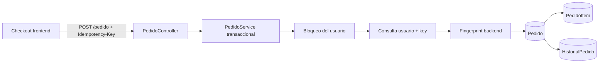
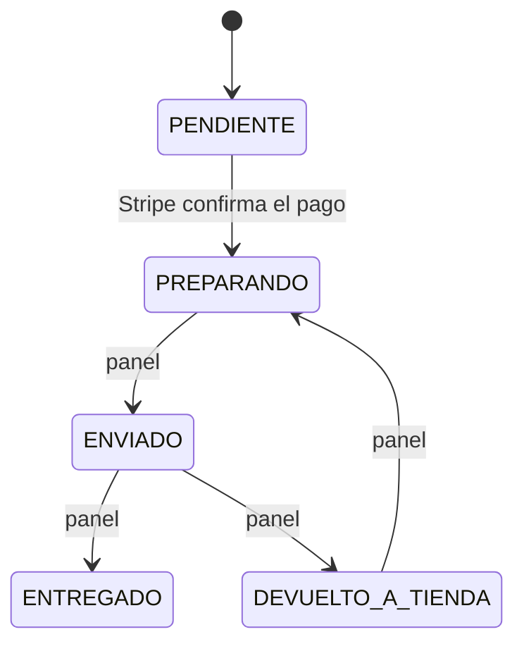
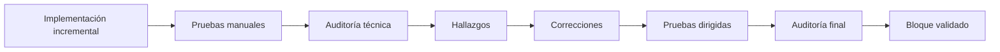

# Pedidos, transacciones y concurrencia — UrbanSneakers

## 1. Objetivo del bloque

El **Bloque 3 — Pedidos, transacciones y concurrencia** se centró en reforzar las garantías internas del ciclo de vida de un pedido. Su objetivo no fue añadir nuevas pantallas ni ampliar visualmente la tienda, sino conseguir que el backend y MariaDB respondieran de forma predecible ante errores, reintentos y operaciones simultáneas.

El trabajo abarcó:

- estados de pedido y de pago;
- transiciones e invariantes;
- límites transaccionales y rollback;
- concurrencia administrativa;
- identificadores públicos;
- historial y trazabilidad;
- idempotencia en la creación de pedidos;
- coherencia entre JPA y el esquema real de MariaDB.

El resultado final fue validado mediante pruebas manuales dirigidas y una auditoría técnica de solo lectura.

## 2. Alcance y estado

**Estado del Bloque 3: TERMINADO Y VALIDADO.**

| Área | Garantía validada |
|---|---|
| Estados | Las transiciones se concentran en reglas explícitas y el panel no gestiona pedidos sin pago confirmado. |
| Atomicidad | Pedido, líneas, cambios de estado, historial y efectos del pago se ejecutan dentro de transacciones. |
| Concurrencia administrativa | `@Version` impide sobrescrituras silenciosas entre operadores. |
| Identificador público | Cada pedido usa `PED-` seguido de un UUID completo y cuenta con unicidad en MariaDB. |
| Trazabilidad | El historial distingue actor humano y proceso automático, además del origen del cambio. |
| Idempotencia | Una key solo puede representar una solicitud lógica para un usuario. |
| Concurrencia de creación | Lock, fingerprint, transacción y restricción única evitan pedidos duplicados para el mismo intento. |

El cierre de este bloque no significa que UrbanSneakers haya terminado su hoja de ruta. Stock, testing automatizado amplio, migraciones versionadas, despliegue y otros trabajos posteriores se revisan de forma independiente.

## 3. Componentes principales

Las responsabilidades del bloque se distribuyen así:

- `PedidoController` exige `Idempotency-Key` y valida `PedidoRequest` antes de crear un pedido.
- `PedidoService` coordina creación, importes, fingerprints, estados, historial y confirmación del pago.
- `PedidoRepository` busca por identificador público y por el par usuario/key.
- `UsuarioRepository` proporciona la lectura con bloqueo pesimista usada durante la creación.
- `AdminPedidoController` expone listados, detalle, historial y cambio de estado mediante DTOs.
- `GlobalExceptionHandler` convierte conflictos de idempotencia y concurrencia optimista en HTTP 409.
- `Pedido`, `PedidoItem` e `HistorialPedido` representan el pedido, su snapshot comercial y sus transiciones.
- MariaDB conserva las restricciones finales que respaldan las reglas de aplicación.



## 4. Estados e invariantes

### 4.1 Estados existentes

`EstadoPedido` contiene:

- `PENDIENTE`;
- `PREPARANDO`;
- `ENVIADO`;
- `ENTREGADO`;
- `DEVUELTO_A_TIENDA`.

`EstadoPago` contiene:

- `PENDIENTE`;
- `PAGADO`;
- `FALLIDO`;
- `CANCELADO`.

La existencia de un valor en el enum no implica que todos los estados tengan actualmente un flujo que los asigne. La documentación describe únicamente las transiciones implementadas.

### 4.2 Creación inicial

Un pedido nuevo se guarda con:

```text
estado = PENDIENTE
estadoPago = PENDIENTE
```

Los importes se calculan en el backend con los productos persistidos. El navegador no determina el precio, el IVA, el envío ni el total definitivo.

### 4.3 Confirmación de Stripe

El webhook firmado delega la confirmación en `PedidoService.confirmarPagoStripe()`. Antes de modificar el pedido se comprueban:

- `payment_status = paid`;
- importe recibido igual al total persistido;
- moneda `EUR`;
- coincidencia entre la Session ID recibida y la almacenada;
- estado inicial `PENDIENTE/PENDIENTE`.

Si las condiciones se cumplen, la transición es:

```text
Pedido PENDIENTE + Pago PENDIENTE
    → Pedido PREPARANDO + Pago PAGADO
```

Un evento repetido sobre un pedido ya pagado no vuelve a ejecutar los efectos de la confirmación.

### 4.4 Transiciones administrativas

El panel solo puede gestionar pedidos cuyo `estadoPago` sea `PAGADO`. Las transiciones permitidas son:



`PENDIENTE` no se avanza manualmente desde el panel y `ENTREGADO` no tiene una transición administrativa posterior en el modelo actual. Solicitar el mismo estado no genera un cambio ni una entrada duplicada en el historial.

## 5. Transacciones y atomicidad

### 5.1 Creación del pedido

`PedidoService.crearPedido()` es transaccional. En la misma unidad de trabajo se realizan:

1. bloqueo y recuperación del usuario autenticado;
2. consulta de una key existente;
3. lectura del carrito;
4. construcción del fingerprint;
5. cálculo de subtotal, IVA, envío y total;
6. persistencia de `Pedido`;
7. persistencia de sus `PedidoItem`.

Si falla una línea o cualquier escritura posterior, la transacción revierte también el pedido. No debe quedar una cabecera sin sus líneas ni una respuesta conflictiva acompañada de datos parciales.

### 5.2 Cambio administrativo e historial

`cambiarEstadoPedido()` modifica el pedido y registra el historial dentro de la misma transacción. Si la transición es inválida, falta el actor, falla la persistencia o se detecta una versión obsoleta, se revierte el conjunto.

Así se evita que:

- el pedido cambie sin historial;
- aparezca una entrada de historial para un cambio que no llegó a confirmarse;
- una actualización concurrente deje una transición parcial.

### 5.3 Confirmación del pago

`confirmarPagoStripe()` agrupa en una transacción local:

- actualización de `estadoPago` y `estado`;
- historial automático;
- creación idempotente de la factura por pedido;
- vaciado del carrito del usuario.

Un error provoca rollback de las escrituras locales realizadas en esa operación. La llamada externa a Stripe ocurre antes, en el flujo de Checkout; la transacción de MariaDB protege los efectos internos posteriores al webhook.

## 6. Concurrencia administrativa

`Pedido.version` está anotado con `@Version`. El listado administrativo expone esa versión mediante `PedidoAdminResumen` y `CambioEstadoPedidoRequest` exige la versión que observó el operador.

El caso protegido es:

```text
Administrador A lee versión N
Administrador B lee versión N

A actualiza el pedido
→ MariaDB/Hibernate avanza la versión

B intenta actualizar con N
→ conflicto HTTP 409
→ no sobrescribe el cambio de A
```

El servicio realiza una comprobación anticipada de la versión y Hibernate mantiene la garantía optimista definitiva al ejecutar el `UPDATE`. Tanto `PedidoConcurrenteException` como `ObjectOptimisticLockingFailureException` se convierten en respuestas 409 controladas.

Deshabilitar un botón en JavaScript no se considera control de concurrencia. La garantía reside en backend y persistencia.

## 7. Identificador público del pedido

Cada pedido tiene dos identificadores con finalidades distintas:

| Identificador | Uso |
|---|---|
| `Pedido.id` | Clave primaria interna `BIGINT`, usada en relaciones y operaciones internas. |
| `Pedido.idPedido` | Referencia pública empleada en API, perfil, Stripe y factura. |

El identificador público se genera con:

```text
PED-{UUID completo en mayúsculas}
```

Su longitud es de 40 caracteres. MariaDB lo almacena como `VARCHAR(40) NOT NULL` y aplica una restricción única. No se utilizan códigos públicos cortos, secuenciales ni derivados de la PK interna.

## 8. Historial y trazabilidad

`HistorialPedido` conserva:

- pedido;
- estado anterior;
- estado nuevo;
- fecha del cambio;
- usuario, cuando existe un actor humano;
- tipo de actor;
- origen.

Las combinaciones válidas son:

| Tipo de cambio | Usuario asociado | `tipoActor` | `origen` |
|---|---:|---|---|
| Operación humana desde el panel | Sí | `USUARIO` | `PANEL_ADMIN` |
| Confirmación automática de Stripe | No | `SISTEMA` | `STRIPE` |

`PedidoService.validarActorHistorial()` rechaza combinaciones incoherentes. Un actor humano debe tener usuario y proceder del panel; un cambio de sistema no puede tener usuario y, en el flujo actual, debe proceder de Stripe.

El historial empieza con las transiciones posteriores a la creación. No se exige una entrada artificial `null → PENDIENTE`.

Los endpoints administrativos convierten las entidades en `PedidoAdminResumen`, `PedidoAdminDetalle`, `PedidoItemAdminDetalle`, `HistorialPedidoRespuesta` y `CambioEstadoPedidoRespuesta`. El contrato HTTP no expone directamente el grafo JPA.

## 9. Idempotencia de creación de pedidos

### 9.1 Garantía funcional

La creación aplica estas reglas:

```text
mismo usuario + misma key + misma solicitud lógica
    = mismo pedido

mismo usuario + misma key + solicitud lógica distinta
    = HTTP 409 Conflict

usuarios distintos + misma key
    = operaciones independientes
```

Nunca se crea un segundo pedido para resolver una colisión de idempotencia.

### 9.2 Contrato HTTP

`POST /pedido` exige el encabezado:

```http
Idempotency-Key: <clave del intento>
```

El backend rechaza claves nulas, vacías o superiores a 36 caracteres. No acepta una key dentro del cuerpo como sustituto del header.

### 9.3 Scope por usuario

La identidad persistente es:

```text
(usuario_id, idempotency_key)
```

`PedidoRepository.findByUsuarioIdAndIdempotencyKey()` utiliza ambos componentes. Esto impide que el intento de un cliente interfiera con otro y permite que dos usuarios generen casualmente la misma key.

### 9.4 Capas de defensa

La solución combina:

1. `Idempotency-Key` como referencia del intento;
2. usuario autenticado como ámbito;
3. fingerprint calculado en backend;
4. bloqueo pesimista de la fila del usuario;
5. transacción local;
6. consulta por usuario y key;
7. restricción única compuesta en JPA y MariaDB.

No se incorporaron locks distribuidos, Redis ni otra infraestructura porque la arquitectura actual puede garantizar el caso con Spring y MariaDB.

## 10. Fingerprint backend

### 10.1 Autoridad

`idempotency_fingerprint` se calcula en `PedidoService`. El navegador no envía una huella que el backend acepte como prueba. Modificar `checkout.js` no permite hacer equivalentes dos solicitudes distintas.

### 10.2 Datos incluidos

La huella representa la intención lógica de compra.

De `PedidoRequest` incluye:

- nombre;
- apellidos;
- email;
- teléfono;
- dirección;
- ciudad;
- provincia;
- código postal;
- país.

De cada línea del carrito incluye:

- identificador del producto;
- talla;
- color;
- cantidad.

### 10.3 Representación canónica

Cada campo se codifica con nombre, longitud y valor. Esta forma evita que separadores presentes dentro de un dato produzcan representaciones ambiguas.

Las líneas se convierten individualmente a esa representación y se ordenan antes de unirlas. Por ello, un orden accidental diferente en una colección JPA no cambia la identidad lógica.

La cadena resultante se procesa con:

```text
SHA-256 + UTF-8 → 64 caracteres hexadecimales
```

### 10.4 Datos excluidos deliberadamente

El código no incorpora:

- `aceptaTerminos`;
- precios procedentes del frontend;
- subtotal, IVA, envío o total;
- estado del pedido o del pago;
- Session ID de Stripe;
- fecha;
- PK interna;
- `idPedido` público.

La aceptación de términos sigue siendo obligatoria mediante validación, pero no define la identidad comercial del intento. Los importes pertenecen al snapshot calculado por el servidor y pueden depender del catálogo vigente; no se confía en valores del navegador. Los identificadores, estados y fechas son consecuencias del procesamiento, no parte de la intención original.

## 11. Relación entre frontend y backend

El frontend utiliza `sessionStorage` para conservar temporalmente:

- la `Idempotency-Key` del intento;
- una representación del formulario y carrito utilizada para UX.

Si el usuario repite el mismo intento en la misma pestaña, reutiliza la key. Si modifica los datos o el carrito, genera otra mediante `crypto.randomUUID()`.

Esta lógica reduce duplicados y evita reutilizaciones accidentales, pero no es una frontera de seguridad. El backend vuelve a calcular su propia huella desde `PedidoRequest` y las entidades persistidas.

## 12. Carrito vacío, reintentos y pedidos legacy

### 12.1 Problema detectado durante la auditoría

Una primera versión trataba el carrito vacío comparando únicamente los datos personales y de envío. Esa información no demostraba que los productos originales fueran los mismos y permitía omitir la validación completa del fingerprint.

### 12.2 Solución final

Si el carrito actual está vacío pero ya existe un pedido para el usuario y la key:

1. se exige que el pedido tenga fingerprint;
2. se toman los datos del `PedidoRequest` recibido;
3. se toman producto, talla, color y cantidad de los `PedidoItem` persistidos;
4. se reconstruye exactamente el mismo formato canónico;
5. se calcula SHA-256;
6. se compara con `Pedido.idempotencyFingerprint`.

Si coincide, se devuelve el mismo pedido. Si no coincide, se responde con conflicto. En ningún caso se crea una segunda fila.

### 12.3 Retry posterior al pago

El carrito no se vacía al crear el pedido. El flujo es:

```text
crear Pedido
→ conservar carrito
→ crear Stripe Checkout
→ webhook confirma el pago
→ PAGADO/PREPARANDO
→ crear factura
→ vaciar carrito
```

Por ello, una respuesta perdida o un retry posterior al pago puede encontrar un pedido válido y un carrito vacío. El snapshot de `PedidoItem` permite demostrar que el reintento representa la compra original.

El estado `PAGADO` no constituye un atajo. Los datos y el fingerprint continúan comparándose antes de devolver el pedido.

### 12.4 Fingerprints legacy nulos

Los pedidos creados antes del blindaje pueden tener `idempotency_fingerprint = NULL`. La columna permanece nullable para conservar esos registros.

El comportamiento es fail-closed:

```text
pedido existente + fingerprint NULL
    → identidad no demostrable
    → HTTP 409 Conflict
```

La coincidencia de nombre o dirección no basta. Esto mantiene la compatibilidad del esquema histórico sin reducir la garantía de las nuevas solicitudes.

## 13. Concurrencia en la creación

### 13.1 Solicitudes idénticas simultáneas

Dos peticiones del mismo usuario y key intentan bloquear la misma fila de usuario. La primera crea el pedido y confirma la transacción. La segunda continúa después, encuentra el pedido, compara el mismo fingerprint y devuelve esa referencia.

Resultado:

- una sola fila de pedido;
- un único conjunto de líneas;
- ambas respuestas convergen al mismo `idPedido`.

### 13.2 Solicitudes diferentes con la misma key

La primera petición puede crear el pedido. La segunda, una vez adquirido el lock, encuentra la misma key pero calcula una huella distinta y recibe HTTP 409.

No se transforma silenciosamente en el pedido de la primera y no crea una alternativa.

### 13.3 Usuarios diferentes

Cada usuario bloquea su propia fila y el índice único incluye `usuario_id`. Por ello, una misma key puede existir una vez para cada usuario sin interferencia.

### 13.4 Responsabilidad de cada defensa

| Defensa | Función |
|---|---|
| Lock pesimista del usuario | Serializa las creaciones del mismo cliente. |
| Transacción | Mantiene juntas consulta, decisión y escrituras. |
| Fingerprint | Distingue una repetición de una solicitud incompatible. |
| Consulta usuario/key | Recupera el intento dentro de su ámbito correcto. |
| UNIQUE compuesta | Impide físicamente dos filas con el mismo par. |

## 14. Idempotencia del pedido e idempotencia de Stripe

UrbanSneakers utiliza dos mecanismos relacionados pero distintos:

| Mecanismo | Operación protegida | Ámbito |
|---|---|---|
| Idempotencia de `POST /pedido` | Persistencia de la intención de compra | Usuario, key y fingerprint backend |
| Idempotencia de Stripe Checkout | Creación o reintento de una Checkout Session | Pedido e intento de sesión Stripe |

Crear un pedido idempotente no sustituye la idempotencia del SDK de Stripe, y una key de Stripe no demuestra que dos cuerpos de `POST /pedido` sean equivalentes.

## 15. Vaciado del carrito

`confirmarPagoStripe()` contiene una única llamada efectiva a `CarritoService.vaciarCarrito()`. Se ejecuta después de:

- validar la confirmación;
- marcar el pedido como pagado y en preparación;
- registrar el historial;
- crear la factura.

El duplicado localizado durante una revisión intermedia fue eliminado. La llamada permanece dentro de la transacción de confirmación.

## 16. Esquema de MariaDB

El dump actualizado confirma estas garantías en `pedidos`:

| Elemento | Esquema actual |
|---|---|
| PK interna | `id BIGINT` |
| Referencia pública | `id_pedido VARCHAR(40) NOT NULL` + UNIQUE |
| Control optimista | `version BIGINT NOT NULL DEFAULT 0` |
| Key | `idempotency_key VARCHAR(36) NOT NULL` |
| Huella | `idempotency_fingerprint VARCHAR(64) NULL` |
| Propietario | `usuario_id BIGINT NOT NULL` + FK |
| Aislamiento idempotente | UNIQUE (`usuario_id`, `idempotency_key`) |
| Sesión de pago | `stripe_session_id` con unicidad cuando existe |

La entidad `Pedido` declara también la restricción compuesta sobre `usuario_id` e `idempotency_key`. No existe una UNIQUE global sobre la key.

`pedido_items` exige la relación con el pedido y conserva producto, nombre, talla, color, cantidad, precio unitario y subtotal de línea. `historial_pedidos` exige pedido, estado nuevo, fecha, actor y origen; el usuario es nullable para permitir cambios automáticos.

## 17. Pruebas manuales realizadas

### 17.1 Idempotencia y aislamiento

| Prueba | Resultado observado |
|---|---|
| Misma key, usuario y solicitud | Mismo pedido; una sola fila. |
| Misma key y dirección distinta | HTTP 409; sin pedido nuevo. |
| Misma key y carrito distinto | HTTP 409; sin pedido nuevo. |
| Misma key en usuarios diferentes | Un pedido independiente para cada propietario. |
| Dos solicitudes idénticas simultáneas | Ambas devolvieron el mismo `idPedido`; una sola fila. |
| Conflicto durante la creación | Sin cabeceras ni `PedidoItem` parciales. |

### 17.2 Carrito vacío y compatibilidad histórica

| Prueba | Resultado observado |
|---|---|
| Carrito vacío, misma key y mismos datos | HTTP 200 y mismo pedido. |
| Carrito vacío y datos diferentes | HTTP 409. |
| Pedido `PAGADO/PREPARANDO`, carrito vacío y retry idéntico | HTTP 200 y mismo pedido. |
| Pedido legacy con fingerprint `NULL` y carrito vacío | HTTP 409. |

Las pruebas utilizaron Spring Boot y MariaDB reales en el entorno local. No se documentan credenciales, cookies, tokens ni claves concretas empleadas durante su ejecución.

Estas comprobaciones manuales no sustituyen la futura suite automatizada prevista en otro bloque.

## 18. Auditorías y correcciones

El Bloque 3 siguió un ciclo incremental:



Durante las revisiones se detectaron, entre otros, estos problemas:

- una key existente no distinguía suficientemente una nueva solicitud lógica;
- la primera solución de carrito vacío comparaba información insuficiente;
- los pedidos legacy con fingerprint nulo necesitaban una política fail-closed;
- la restricción compuesta de MariaDB debía reflejarse también en JPA;
- el vaciado del carrito estaba duplicado en la confirmación del pago.

Las correcciones incorporaron el fingerprint backend, la reconstrucción desde `PedidoItem`, el rechazo seguro de legacy, la `@UniqueConstraint` compuesta y una única llamada de vaciado.

La auditoría final revisó código, DTOs, locks, transacciones, excepciones y el dump real de MariaDB. No detectó hallazgos `BLOCKING`, `IMPORTANT` ni `MINOR` relevantes dentro del alcance definido.

**Resultado oficial: 🟢 PASA — BLOQUE 3 PUEDE CERRARSE.**

## 19. Garantías finales

Tras el cierre del Bloque 3 puede afirmarse que:

- las transiciones actuales están formalizadas;
- el panel no puede gestionar pedidos sin pago confirmado;
- pedido e historial cambian atómicamente;
- `@Version` evita el last-write-wins administrativo;
- los identificadores públicos utilizan UUID completo;
- el historial diferencia actores y orígenes;
- el backend calcula la identidad lógica de la compra;
- una key no puede representar dos solicitudes distintas del mismo usuario;
- usuarios diferentes permanecen aislados;
- las creaciones concurrentes equivalentes convergen al mismo pedido;
- los conflictos no dejan pedidos ni líneas parciales;
- los reintentos post-pago siguen siendo verificables con el snapshot;
- los fingerprints legacy nulos fallan de forma cerrada;
- JPA y MariaDB comparten la restricción única usuario/key.

Estas garantías se limitan al Bloque 3. La hoja de ruta global de UrbanSneakers continúa con bloques técnicos posteriores.
