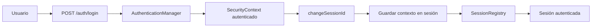
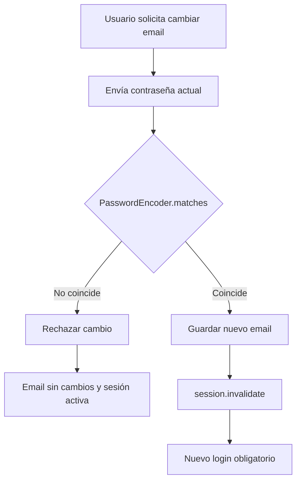
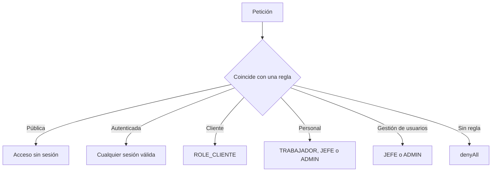
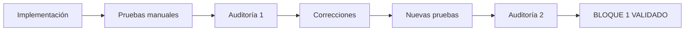

# Seguridad — UrbanSneakers

## 1. Objetivo del bloque

La seguridad se priorizó como el primer bloque de profesionalización de UrbanSneakers. El objetivo fue reducir riesgos inmediatos en autenticación, autorización, sesiones, exposición de datos y representación de información recibida por el frontend, manteniendo la arquitectura actual de la aplicación.

El resultado de esta fase es el **Bloque 1 — Seguridad inmediata**, implementado, probado manualmente y revisado mediante dos auditorías de solo lectura.

## 2. Alcance

Este documento describe exclusivamente las medidas incluidas en el Bloque 1:

- exposición controlada de datos mediante DTOs;
- protección frente a XSS en los flujos revisados;
- protección frente a session fixation;
- registro y revocación de sesiones;
- cambios sensibles de contraseña y email;
- separación de permisos por rol;
- política de autorización fail-closed;
- validación de firma del webhook de Stripe;
- ocultación de información interna en errores estándar.

Los demás bloques de la hoja de ruta se analizan de forma independiente. El **Bloque 2 — Stripe y pagos** está en progreso: la prevención de Checkout duplicado y la eliminación de endpoints legacy ya fueron validadas, mientras que el endurecimiento del webhook, la confirmación del pago, los efectos sobre el carrito y otros casos permanecen pendientes. Su estado se documenta en [stripe-pagos.md](stripe-pagos.md). También continúan pendientes stock, modelo y restricciones de base de datos, testing automatizado, logging, configuración por entornos, Docker, CI/CD, OpenAPI y despliegue.

## 3. Medidas implementadas

### 3.1 Protección frente a exposición de entidades

Los DTOs delimitan los datos que acepta y devuelve la API. De esta forma, una respuesta no expone automáticamente todos los campos y relaciones de una entidad JPA.

El cambio de estado administrativo es un ejemplo directo: `AdminPedidoController` trabaja internamente con `Pedido`, pero devuelve `CambioEstadoPedidoRespuesta`. Esta respuesta contiene únicamente:

- identificador interno;
- identificador público del pedido;
- estado actualizado.

No devuelve el objeto `Pedido` completo, sus relaciones, el usuario asociado ni información interna innecesaria. Los listados administrativos de pedidos y usuarios también utilizan respuestas específicas.

### 3.2 Protección frente a XSS

Insertar datos dinámicos mediante `innerHTML` puede permitir que un valor manipulado se interprete como etiquetas o JavaScript. Este riesgo es especialmente relevante en los productos, porque nombre, marca y color pueden modificarse desde el panel.

Las vistas revisadas construyen el contenido dinámico con:

- `document.createElement()`;
- `textContent` y `createTextNode()`;
- `append()`, `appendChild()` y `replaceChildren()`;
- propiedades DOM como `img.src`, `img.alt` y `element.dataset`.

Así, un valor con apariencia de HTML se representa como texto y no se ejecuta. Los `innerHTML` que permanecen en el alcance revisado contienen mensajes constantes escritos por la aplicación y no interpolan datos del backend.

Áreas endurecidas y revisadas:

- pedidos del panel;
- productos del panel;
- empleados;
- tarjetas del catálogo público;
- pedidos y productos del perfil;
- carrito;
- resumen del checkout.

### 3.3 Protección frente a session fixation

UrbanSneakers realiza un login manual mediante `AuthenticationManager`. Después de validar las credenciales:

1. crea y establece un `SecurityContext` autenticado;
2. obtiene la sesión HTTP;
3. renueva su identificador mediante `changeSessionId()`;
4. guarda el `SecurityContext` en la sesión;
5. registra la nueva sesión en `SessionRegistry`.

La renovación impide continuar utilizando el identificador previo al login y conserva correctamente el estado autenticado.



### 3.4 Revocación de sesiones

`SessionRegistry` mantiene las sesiones conocidas y `HttpSessionEventPublisher` actualiza el registro cuando finalizan. Al editar administrativamente un empleado, `UsuarioService` compara el estado anterior con el solicitado.

Las sesiones se marcan como expiradas cuando:

- cambia el rol del empleado;
- la cuenta pasa de activa a inactiva.

La expiración se realiza con `SessionInformation.expireNow()`. La expulsión se hace efectiva en la siguiente petición de esa sesión. Un cambio exclusivo de nombre no expulsa al usuario y una reactivación tampoco provoca una expulsión innecesaria.

### 3.5 Cambios sensibles de contraseña

Los cambios de contraseña propia de `CLIENTE`, `TRABAJADOR`, `JEFE` y `ADMIN` requieren:

- contraseña actual obligatoria;
- comprobación con `PasswordEncoder.matches()`;
- nueva contraseña válida y confirmada;
- almacenamiento con `PasswordEncoder.encode()`.

La contraseña actual admite hasta 72 caracteres, pero no debe cumplir la política de una contraseña nueva. La nueva contraseña admite entre 8 y 72 caracteres y debe contener al menos una letra y un número.

Existe una diferencia deliberada entre dos operaciones:

- **Cambio propio:** siempre exige conocer la contraseña actual.
- **Restablecimiento administrativo de otro empleado:** un JEFE o ADMIN autorizado no necesita conocer la contraseña anterior del empleado.

La vía administrativa impide que el usuario la utilice para editarse a sí mismo y evitar la comprobación de su contraseña actual.

### 3.6 Mi cuenta del personal

El área propia de `TRABAJADOR`, `JEFE` y `ADMIN` permite modificar:

- nombre;
- email;
- contraseña.

Los DTOs y métodos dedicados no reciben rol, estado activo ni permisos. Esos atributos no pueden autoeditarse a través de “Mi cuenta”, lo que reduce el riesgo de mass assignment y escalada de privilegios.

### 3.7 Cambio sensible de email

El cambio propio de email, tanto para clientes como para personal, requiere la contraseña actual. El backend la compara con el hash almacenado antes de modificar el correo.



Si la contraseña es incorrecta, el email permanece intacto y la sesión sigue activa. Si el cambio se completa, el controller invalida la sesión desde el backend. La seguridad no depende de una redirección o cierre realizado únicamente por JavaScript.

### 3.8 Política fail-closed

La configuración anterior utilizaba una apertura general mediante `anyRequest().permitAll()`. El Bloque 1 adoptó una política fail-closed: las rutas legítimas se declaran expresamente y la configuración termina con `anyRequest().denyAll()`.



#### Matriz de endpoints y roles

| Método | Ruta | Acceso |
|---|---|---|
| `POST` | `/auth/login` | Público |
| `POST` | `/auth/registro` | Público |
| `GET` | `/auth/csrf` | Público |
| `GET` | `/productos` | Público |
| `GET` | `/api/saludo` | Público |
| Cualquiera | `/error` | Manejo de errores de Spring |
| `POST` | `/api/stripe/webhook` | Público con firma Stripe |
| `GET` | `/auth/me` | Autenticado |
| `POST` | `/auth/logout` | Autenticado |
| `PUT` | `/cliente/perfil/nombre` | CLIENTE |
| `PUT` | `/cliente/perfil/email` | CLIENTE |
| `PUT` | `/cliente/perfil/password` | CLIENTE |
| `GET` | `/cliente/perfil/pedidos` | CLIENTE |
| `GET` | `/cliente/perfil/pedidos/{idPedido}/factura` | CLIENTE |
| `GET`, `POST`, `DELETE` | `/carrito` y `/carrito/**` | CLIENTE |
| `GET`, `POST` | `/pedido` y `/pedido/**` | CLIENTE |
| `POST` | `/api/stripe/checkout/pedido` | CLIENTE |
| `GET`, `PATCH` | `/admin/pedidos` y `/admin/pedidos/**` | TRABAJADOR, JEFE o ADMIN |
| `GET`, `POST`, `PUT` | `/admin/productos` y `/admin/productos/**` | TRABAJADOR, JEFE o ADMIN |
| `PUT` | `/admin/mi-cuenta/nombre` | TRABAJADOR, JEFE o ADMIN |
| `PUT` | `/admin/mi-cuenta/email` | TRABAJADOR, JEFE o ADMIN |
| `PUT` | `/admin/mi-password` | TRABAJADOR, JEFE o ADMIN |
| `GET`, `POST`, `PUT` | `/admin/usuarios` y `/admin/usuarios/**` | JEFE o ADMIN |
| Cualquiera | Cualquier ruta no declarada | Denegado |

El matcher específico de `/admin/usuarios/**` aparece antes que el matcher general `/admin/**`, por lo que un `TRABAJADOR` no obtiene acceso accidental a la gestión de empleados.

### 3.9 Protección del webhook de Stripe

`POST /api/stripe/webhook` debe ser público porque Stripe lo invoca desde fuera de la sesión del usuario. Por ello, no se protege mediante login y está excluido de CSRF.

Su autenticidad se comprueba mediante el encabezado `Stripe-Signature` y `Webhook.constructEvent(payload, signature, webhookSecret)`. Un evento con firma no válida se rechaza.

Esta medida no sustituye el análisis específico de Stripe. El Bloque 2 ya validó la idempotencia de creación de Checkout, la reutilización controlada de sesiones y la eliminación de endpoints legacy. La idempotencia y concurrencia completas del webhook, las validaciones adicionales del pago, las transacciones y sus efectos posteriores permanecen pendientes.

### 3.10 Manejo seguro de errores

La ruta `/error` se permite expresamente para que Spring pueda completar el dispatch de errores. Esto evita que un error real, como utilizar un método HTTP no admitido, se transforme en un `403` artificial por la regla final `denyAll()`.

La configuración estándar utiliza:

```properties
spring.web.error.include-exception=false
spring.web.error.include-stacktrace=never
spring.web.error.include-message=never
spring.web.error.include-binding-errors=never
```

Estas propiedades evitan incluir en las respuestas estándar:

- stack traces;
- nombres y detalles de excepciones;
- binding errors;
- mensajes internos.

`GlobalExceptionHandler` continúa ofreciendo mensajes controlados de negocio y validación, sin devolver trazas Java o Spring.

## 4. Pruebas de seguridad realizadas

Las siguientes pruebas manuales se realizaron durante el Bloque 1. Documentan el comportamiento observado, pero no sustituyen una futura suite automatizada.

### 4.1 Session fixation

1. Se obtuvo la sesión existente antes del login.
2. Se realizó el login con credenciales válidas.
3. Se comprobó que el valor de `JSESSIONID` había cambiado.
4. Se verificó que la nueva sesión conservaba el usuario autenticado.

Resultado: renovación correcta del identificador sin perder el contexto autenticado.

### 4.2 Revocación de sesión

1. Se inició sesión con un usuario de personal.
2. Desde otra sesión administrativa se cambió su rol.
3. Se regresó a la sesión afectada.
4. En la siguiente petición, el usuario fue expulsado.
5. Se repitió la prueba desactivando la cuenta activa.

Resultado: cambio de rol y desactivación provocaron la expiración esperada.

### 4.3 Contraseña propia

- Contraseña actual incorrecta: operación rechazada.
- Contraseña actual correcta y nueva contraseña sin número: operación rechazada.
- Contraseña actual correcta y nueva contraseña válida: operación aceptada.
- Tras cerrar sesión, el login con la nueva contraseña funcionó correctamente.

Resultado: la comprobación de contraseña actual, la política de contraseña nueva y su almacenamiento codificado fueron coherentes.

### 4.4 Cambio de email

- Con contraseña incorrecta, el cambio fue rechazado, el email no se modificó y la sesión continuó activa.
- Con contraseña correcta, el email cambió y el backend invalidó la sesión.
- Para continuar se exigió iniciar sesión con el nuevo email.

Resultado: el cierre de sesión posterior al cambio no depende exclusivamente del frontend.

### 4.5 Fail-closed

Se comprobaron los siguientes escenarios:

- acceso público correcto a `/productos`;
- acceso público correcto a `/api/saludo`;
- acceso restringido a `/admin/pedidos`;
- acceso restringido a `/admin/usuarios`;
- bloqueo de la ruta inexistente `/paco/robar-tienda`;
- permisos propios de `CLIENTE`;
- permisos de `TRABAJADOR` para pedidos y productos, pero no para empleados;
- permisos de `JEFE` y `ADMIN` para gestionar empleados;
- pérdida de acceso autenticado después del logout.

Resultado: no se observó una apertura accidental ni una ampliación incorrecta de roles.

### 4.6 XSS

Para la prueba se modificó temporalmente el nombre de un producto con este valor:

```text

```

Antes del hardening, las construcciones dinámicas con `innerHTML` del carrito y checkout podían interpretar el payload. Después de construir el DOM mediante elementos y contenido de texto:

- el catálogo no ejecutó el payload;
- el carrito no lo ejecutó;
- el checkout no lo ejecutó;
- el contenido apareció como texto literal;
- el funcionamiento normal del carrito y checkout se mantuvo.

### 4.7 `/error`

Inicialmente `/error` quedaba alcanzado por `denyAll()` y devolvía `403`. Después de permitir expresamente esa ruta:

1. un `GET /auth/login`, cuyo endpoint solo admite `POST`, devolvió `405 Method Not Allowed`;
2. durante una comprobación intermedia se observó un stack trace en la respuesta;
3. se configuraron las propiedades `spring.web.error.*` para ocultar información interna;
4. la prueba final mantuvo el `405` sin `trace`, `exception`, clases internas ni stack trace.

## 5. Auditorías realizadas

El Bloque 1 fue sometido a dos auditorías en modo solo lectura. Ninguna de ellas aplicó correcciones automáticamente.

### 5.1 Primera auditoría

**Resultado: BLOQUE 1 NO VALIDADO**

La primera revisión detectó:

1. validaciones de la contraseña nueva mal colocadas en `ActualizarPasswordClienteRequest`;
2. XSS residual en `frontend/js/carrito.js`;
3. XSS residual en `frontend/js/checkout.js`;
4. posible regresión del manejo de `/error` por la política `denyAll()`.

Los puntos se corrigieron y se repitieron las pruebas manuales correspondientes.

### 5.2 Segunda auditoría

**Resultado: BLOQUE 1 VALIDADO**

La segunda auditoría volvió a revisar:

- los problemas detectados en la primera auditoría;
- los ocho puntos completos del Bloque 1;
- la matriz de endpoints y roles;
- los sinks XSS de los flujos incluidos;
- session fixation, registro y revocación de sesiones;
- cambios sensibles de cuenta;
- manejo de errores y posibles regresiones.

El resultado final fue:

- sin endpoints públicos por accidente;
- sin endpoints legítimos bloqueados por error;
- sin roles incorrectos en la matriz actual;
- sin XSS dinámico detectado en los flujos revisados;
- política fail-closed aplicada correctamente;
- respuestas estándar sin stack traces ni excepciones internas;
- sin regresiones evidentes introducidas por el bloque.

### 5.3 Ciclo de validación



## 6. Estado del bloque

El código y las pruebas manuales documentadas permiten considerar cerrado el **Bloque 1 — Seguridad inmediata**. Esta validación se limita a su alcance; el avance parcial del Bloque 2 se mantiene documentado y validado de forma independiente.

**Estado final: BLOQUE 1 VALIDADO.**
