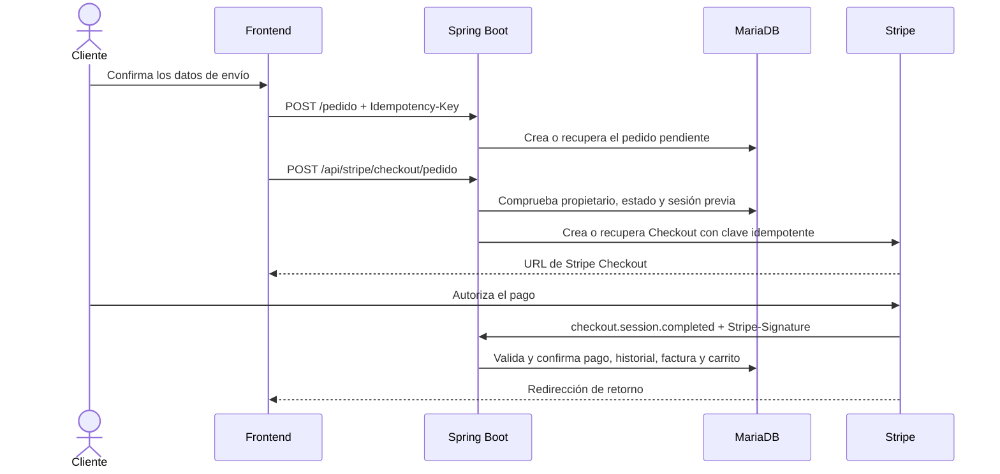

# Stripe y pagos — UrbanSneakers

## 1. Objetivo del bloque

Stripe y los pagos se revisaron como un bloque independiente porque combinan estado local, una operación externa y una confirmación asíncrona. Una Checkout Session puede existir en Stripe antes de que su identificador quede persistido en MariaDB, y la URL de retorno del navegador no demuestra por sí sola que el pedido haya sido pagado.

El **Bloque 2 — Stripe y pagos** tuvo como objetivo consolidar un único flujo de cobro basado en pedidos persistidos, reducir sesiones duplicadas y hacer que la confirmación recibida por webhook sea verificable y consistente con la información económica guardada por UrbanSneakers.

## 2. Alcance y estado

**Estado del Bloque 2: TERMINADO Y VALIDADO para el alcance trabajado.**

| Área | Estado |
|---|---|
| Evitar Checkout duplicado | **VALIDADO** |
| Eliminar endpoints legacy | **VALIDADO** |
| Validar la confirmación económica | **VALIDADO** |
| Procesar reenvíos sin repetir efectos | **VALIDADO mediante el estado persistido** |
| Aplicar factura y vaciado del carrito dentro de la operación confirmada | **VALIDADO** |

Esta validación no significa que toda posible evolución de pagos esté terminada. UrbanSneakers no mantiene actualmente un registro independiente por `event.id` de Stripe y el frontend no consulta al backend para convertir la URL de retorno en una confirmación adicional. Esas posibilidades quedan fuera del alcance cerrado y no se presentan como funcionalidades actuales.

Las garantías transaccionales compartidas con pedidos, la concurrencia y la idempotencia de `POST /pedido` se documentan por separado en [pedidos-transacciones-concurrencia.md](pedidos-transacciones-concurrencia.md).

## 3. Arquitectura del flujo actual



Las responsabilidades principales son:

- `StripeController` expone el único inicio de Checkout permitido y opera sobre un pedido persistido del cliente autenticado;
- `StripeService` construye las líneas desde los importes guardados por el backend y aplica la clave idempotente a la llamada real de Stripe;
- `StripeWebhookController` verifica la firma, extrae la sesión del evento y entrega al dominio los datos que deben contrastarse;
- `PedidoService` valida el pago contra el pedido y ejecuta sus efectos dentro de una transacción;
- `FacturaService` crea la factura asociada al pedido confirmado;
- `CarritoService` vacía el carrito únicamente después de una confirmación válida.

## 4. Checkout vinculado a un pedido

La aplicación conserva una única ruta de creación:

```text
POST /api/stripe/checkout/pedido
```

El cliente no envía líneas ni precios a Stripe por su cuenta. El controller localiza el pedido mediante su identificador público, comprueba que pertenece al usuario autenticado y valida su estado antes de delegar en el servicio.

Esta decisión evita iniciar un cobro que no pueda reconciliarse con una entidad `Pedido`. Los importes y las líneas proceden del snapshot persistido, no de valores económicos manipulables desde JavaScript.

## 5. Prevención de Checkout duplicado

### 5.1 Problema original

Un doble clic, un reintento de red o dos solicitudes simultáneas podían intentar crear más de una Checkout Session para el mismo pedido. Comprobar únicamente si `stripeSessionId` estaba relleno no cerraba la ventana en la que Stripe ya había creado una sesión pero la aplicación todavía no la había guardado.

### 5.2 Estrategia actual

El flujo combina estado local y la idempotencia proporcionada por Stripe:

1. si el pedido contiene una sesión previa, el backend la recupera desde Stripe;
2. una sesión `OPEN` se reutiliza;
3. una sesión `COMPLETE` impide iniciar otro cobro para el mismo intento;
4. una sesión `EXPIRED` permite un reintento controlado;
5. al crear la sesión se utiliza una clave determinista basada en el pedido y el intento;
6. esa clave se entrega en `RequestOptions.setIdempotencyKey()` a `Session.create()`.

La llamada idempotente a Stripe es la garantía decisiva ante dos creaciones iniciales concurrentes: solicitudes equivalentes convergen en la misma operación externa.

### 5.3 Alcance de esta idempotencia

La clave de Stripe Checkout no es la `Idempotency-Key` utilizada al crear el pedido. Son mecanismos diferentes:

| Mecanismo | Protege |
|---|---|
| Idempotencia de `POST /pedido` | La creación local del pedido y la identidad lógica de la compra por usuario. |
| Idempotencia de Stripe Checkout | La creación externa de la Checkout Session de un pedido e intento concretos. |

No se utiliza el fingerprint del frontend como autoridad en ninguno de los controles económicos del pago.

## 6. Eliminación de rutas legacy

Los Checkouts antiguos que partían directamente de parámetros o del carrito se eliminaron. Mantenerlos habría permitido iniciar un cobro sin pasar por el mismo pedido persistido y habría duplicado las reglas de cálculo, propiedad y reconciliación.

La política `anyRequest().denyAll()` de Spring Security hace que una ruta Stripe no declarada expresamente quede bloqueada. El único inicio de pago autorizado para un cliente es el endpoint basado en pedido; el webhook permanece público porque Stripe debe invocarlo externamente, pero exige firma válida.

## 7. Verificación del webhook

`StripeWebhookController` recibe el cuerpo sin transformar y el encabezado `Stripe-Signature`. Antes de interpretar el evento ejecuta:

```java
Webhook.constructEvent(payload, signature, webhookSecret)
```

Una firma inválida impide continuar. Para `checkout.session.completed`, el controller obtiene de la sesión:

- identificador de Stripe;
- identificador público del pedido incluido en los metadatos;
- `payment_status`;
- `amount_total`;
- `currency`.

El endpoint es público y está excluido de CSRF por necesidad técnica, pero eso no equivale a confiar en cualquier petición: la firma de Stripe es su control de autenticidad.

## 8. Validación de la confirmación económica

`PedidoService.confirmarPagoStripe()` no acepta el nombre del evento como prueba suficiente. Antes de modificar el pedido valida:

1. que el identificador de la sesión y el identificador público del pedido estén presentes;
2. que `payment_status` sea `paid`;
3. que `amount_total` sea válido;
4. que la moneda sea EUR;
5. que el pedido exista;
6. que el importe recibido en céntimos coincida exactamente con el total persistido;
7. que `stripeSessionId` coincida con la sesión guardada en el pedido;
8. que, si todavía no estaba pagado, el pedido y el pago estén ambos en estado `PENDIENTE`.

Solo después de estas comprobaciones se realiza la transición:

```text
EstadoPago: PENDIENTE → PAGADO
EstadoPedido: PENDIENTE → PREPARANDO
```

El backend vuelve a calcular la comparación desde el `BigDecimal` persistido y no confía en precios, subtotal o total enviados por el navegador.

## 9. Reenvíos, idempotencia y concurrencia del webhook

Stripe puede reenviar un evento si no recibe respuesta o si existe un fallo de red. El procesamiento actual utiliza el estado persistido del pedido como barrera de repetición:

- antes de reconocer un pedido ya pagado, vuelve a validar estado de pago recibido, moneda, importe y sesión;
- si el pedido ya está `PAGADO`, finaliza sin volver a cambiar el estado, crear otra factura ni vaciar nuevamente el carrito;
- si no está pendiente ni pagado de forma coherente, rechaza la transición;
- `@Version` en `Pedido` permite detectar escrituras concurrentes sobre una versión obsoleta;
- la relación única entre factura y pedido impide representar dos facturas para el mismo pedido;
- la transacción evita conservar una confirmación parcial si falla uno de sus efectos.

La estrategia validada es idempotencia por estado de dominio, no por un ledger de eventos. El `event.id` de Stripe no se persiste actualmente en una tabla de eventos procesados. Añadir ese registro solo debería plantearse en un bloque futuro si se necesita trazabilidad individual de todos los eventos o soportar más tipos con efectos independientes.

## 10. Atomicidad de los efectos posteriores

`confirmarPagoStripe()` se ejecuta con `@Transactional`. Dentro de la misma operación se agrupan:

1. actualización de `EstadoPago`;
2. transición del pedido a `PREPARANDO`;
3. registro del historial con actor `SISTEMA` y origen `STRIPE`;
4. creación de la factura;
5. vaciado del carrito del propietario.

Si una excepción provoca rollback, no debe persistirse solamente una parte de ese conjunto. Esto evita, por ejemplo, dejar el pedido pagado sin su historial o consumir el carrito sin haber confirmado correctamente el resto de efectos.

La implementación final contiene una única llamada efectiva a `vaciarCarrito()` y se encuentra después de las validaciones, la actualización de estado, el historial y la factura. Un duplicado detectado durante la revisión fue eliminado.

## 11. Relación con el carrito y los reintentos

El carrito se conserva durante la creación del pedido y durante la apertura de Checkout. Solo se vacía cuando el webhook confirma correctamente el pago. Esta secuencia permite reintentar el acceso a Stripe sin perder la selección antes de que exista una confirmación real.

Después del pago, un reintento legítimo de `POST /pedido` puede encontrar el carrito vacío. Ese caso no pertenece a la idempotencia de Stripe: el Bloque 3 lo resuelve reconstruyendo la intención desde el request y el snapshot de `PedidoItem`, y sigue exigiendo que el fingerprint coincida. El detalle está en [pedidos-transacciones-concurrencia.md](pedidos-transacciones-concurrencia.md#12-carrito-vacío-reintentos-y-pedidos-legacy).

## 12. URL de retorno y fuente de verdad

Stripe redirige al navegador a una URL de éxito o cancelación. Esa navegación sirve para recuperar la experiencia de usuario, pero puede escribirse o recargarse manualmente y no certifica el pago.

El frontend actual muestra el mensaje de retorno utilizando los parámetros de la URL. La garantía de negocio no depende de ese mensaje: el pago solo queda confirmado cuando el webhook válido actualiza el estado persistido. El perfil, la factura y la gestión administrativa consumen ese estado del backend.

Consultar expresamente al backend al regresar de Stripe sería una mejora adicional de presentación y sincronización, no una sustitución del webhook. No forma parte del alcance validado del Bloque 2.

## 13. Pruebas y revisiones realizadas

Las pruebas manuales documentadas para la creación y reutilización de Checkout fueron:

| Prueba | Evidencia observada |
|---|---|
| Nuevo Checkout para pedido `PAGADO` | Rechazado; no se creó otra sesión. |
| Segunda solicitud sobre sesión `OPEN` | Misma Session ID y misma operación. |
| Reintento sobre sesión `EXPIRED` | Nueva sesión y sustitución controlada de `stripeSessionId`. |
| Dos solicitudes concurrentes desde `NULL` | Ambas devolvieron la misma Session ID. |
| Persistencia posterior a concurrencia | MariaDB conservó la Session ID compartida. |
| Compra completa mediante el flujo actual | Pedido persistido, pago `PAGADO`, pedido `PREPARANDO` y mismo `idPedido` en el perfil. |
| Acceso a los dos endpoints legacy | `403 Forbidden`; no se creó Checkout. |

La revisión del bloque fue incremental. Una primera auditoría detectó que reutilizar una sesión ya persistida no cerraba la carrera durante la creación inicial. La solución fue aplicar la clave idempotente en la llamada real a Stripe y repetir la prueba concurrente. Las revisiones posteriores comprobaron en el código la validación de firma, sesión, estado pagado, importe y moneda; también verificaron el límite transaccional, el retorno temprano de un pedido ya pagado y la existencia de una sola llamada al vaciado del carrito.

Estas pruebas manuales documentan el comportamiento observado, pero no sustituyen la suite automatizada amplia que permanece en la hoja de ruta.

## 14. Garantías y límites actuales

El Bloque 2 permite afirmar dentro de su alcance que:

- todo Checkout parte de un pedido persistido y perteneciente al cliente;
- la aplicación no construye el cobro a partir de precios confiados al frontend;
- las creaciones concurrentes equivalentes de Checkout utilizan idempotencia de Stripe;
- las rutas de cobro legacy no permanecen accesibles;
- la firma se verifica antes de procesar el webhook;
- sesión, estado pagado, importe y moneda se contrastan con el pedido;
- los reenvíos sobre un pedido pagado no repiten los efectos de dominio;
- estado, historial, factura y carrito se coordinan transaccionalmente;
- la redirección del navegador no se considera prueba de pago.

Siguen fuera de este cierre:

- un registro persistente independiente para cada `event.id` recibido;
- confirmación visual del retorno mediante una consulta específica del frontend al backend;
- tests automatizados exhaustivos de Stripe y del webhook;
- observabilidad centralizada, alertas y reconciliación operativa propia de producción;
- configuración de despliegue y rotación de secretos por entornos.

## 15. Estado final

La implementación, las pruebas manuales y las auditorías permiten considerar **TERMINADO Y VALIDADO el Bloque 2 — Stripe y pagos para el alcance trabajado**.

Este cierre no afirma que UrbanSneakers esté terminado ni que no existan ampliaciones posibles. La hoja de ruta continúa y las garantías de pedidos, transacciones y concurrencia se cerraron posteriormente en el [Bloque 3](pedidos-transacciones-concurrencia.md).
