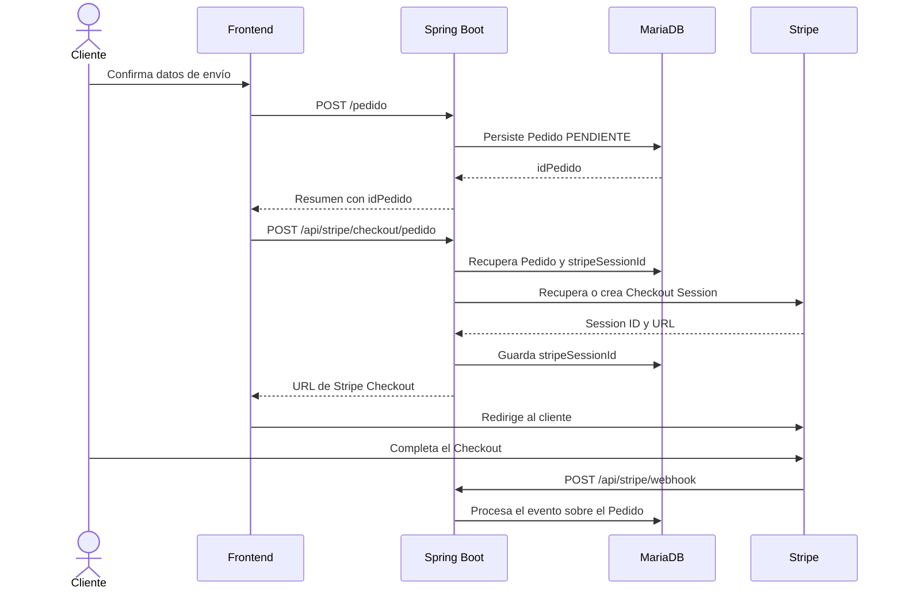
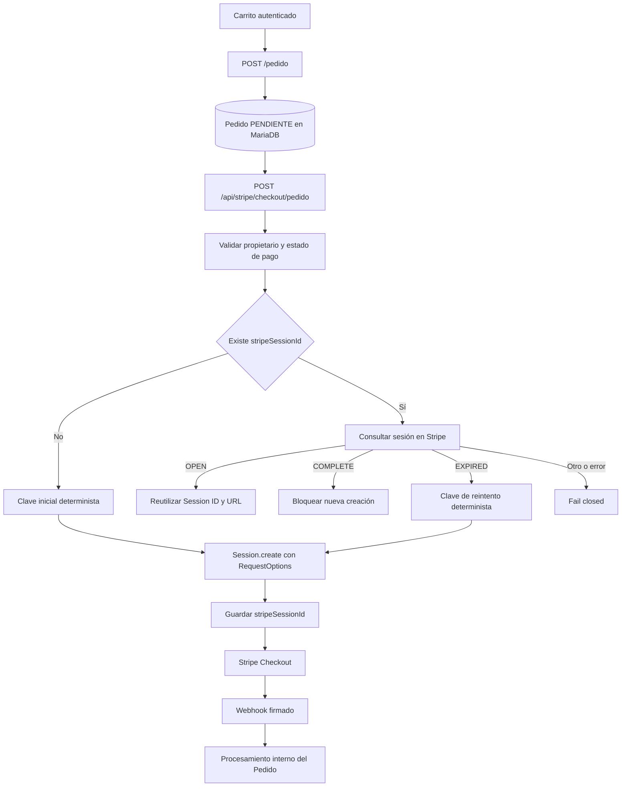
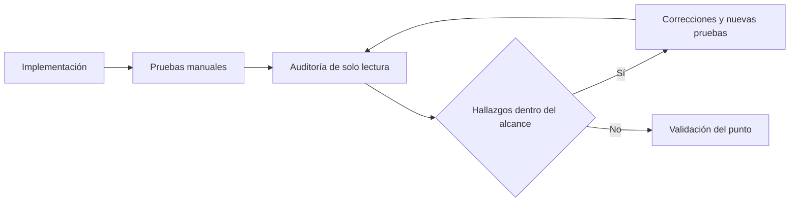

# Stripe y pagos — UrbanSneakers

## 1. Objetivo del bloque

Stripe y los pagos se revisan como un bloque independiente porque combinan estado local, una operación externa y confirmaciones asíncronas. Una Checkout Session puede existir en Stripe antes de que su identificador quede persistido en MariaDB, y la redirección del navegador no garantiza por sí sola que el pedido haya sido pagado.

El **Bloque 2 — Stripe y pagos** tiene como objetivo consolidar un único flujo de cobro basado en pedidos persistidos, reducir duplicados y preparar la confirmación posterior para que sea consistente, verificable y mantenible.

Este documento registra las decisiones, pruebas y auditorías del bloque. Se ampliará conforme se implementen y validen los siguientes puntos.

## 2. Alcance y estado actual

**Estado del Bloque 2: EN PROGRESO.**

| Punto | Objetivo | Estado |
|---|---|---|
| 1 | Cerrar duplicados de Checkout/pagos | **VALIDADO** |
| 2 | Eliminar endpoints Stripe antiguos | **VALIDADO** |
| 3 | Validar que el pago esté realmente confirmado | **PENDIENTE** |
| 4 | Blindar webhook e idempotencia | **PENDIENTE** |
| 5 | Corregir el vaciado del carrito | **PENDIENTE** |
| 6 | Confirmar el éxito consultando al backend | **PENDIENTE** |
| 7 | Limpiar efectos secundarios y casos menores | **PENDIENTE** |

La validación de los Puntos 1 y 2 no implica que el bloque completo esté cerrado. En particular, todavía no se consideran resueltos `payment_status`, `amount_total`, `currency`, la persistencia de `event.id`, la concurrencia completa del webhook, el vaciado tardío del carrito, la confirmación frontend contra el backend ni los estados de pago adicionales.

## 3. Arquitectura actual del flujo de pago

El pago parte siempre de un pedido persistido. El carrito no crea directamente una Checkout Session.



Las responsabilidades principales son:

- `PedidoController` crea el pedido a partir del carrito autenticado.
- `StripeController` valida el pedido y decide si debe reutilizar o crear una sesión.
- `StripeService` recupera sesiones existentes y construye Checkout Sessions desde `Pedido`.
- `PedidoService` valida el estado, persiste `stripeSessionId` y procesa los efectos internos del webhook.
- `StripeWebhookController` verifica la firma del evento antes de delegar su procesamiento.
- `frontend/js/checkout.js` crea primero el pedido y después solicita el Checkout mediante su `idPedido`.

## 4. Punto 1 — Prevención de Checkout duplicado

### 4.1 Problema original

Un mismo pedido podía provocar varias Checkout Sessions independientes. El riesgo aparecía ante doble clic, reintentos, llamadas concurrentes o un fallo local después de que Stripe hubiera creado una sesión.

El escenario problemático era:

```text
Pedido PENDIENTE
    → Stripe crea sesión A
    → otra solicitud crea sesión B
    → MariaDB conserva solo B
    → A continúa siendo válida en Stripe
```

Si el cliente pagaba A, UrbanSneakers podía esperar B. También existía la posibilidad de intentar iniciar otro Checkout para un pedido ya marcado como pagado.

### 4.2 Validación del pedido

`PedidoService.validarPedidoPuedeIniciarPago()` impide iniciar otro pago cuando `EstadoPago` ya es `PAGADO`.

`StripeController` ejecuta esta validación antes de:

- recuperar una sesión existente;
- crear una nueva Checkout Session;
- modificar `stripeSessionId`.

El pedido se obtiene además mediante el identificador público y el usuario autenticado, por lo que el Checkout queda vinculado al propietario.

### 4.3 Reutilización y estados de la sesión

Cuando el pedido ya contiene `stripeSessionId`, el backend consulta la sesión real mediante `StripeService.obtenerSesionCheckout()` y aplica estas reglas:

| Estado de Stripe | Comportamiento |
|---|---|
| `open` | Devuelve la misma Session ID y la misma URL; no crea otra sesión. |
| `complete` | Bloquea una nueva creación porque Stripe ya completó ese Checkout. |
| `expired` | Permite un nuevo intento controlado. |
| Desconocido o nulo | Falla de forma cerrada y no crea otro Checkout. |
| Error al consultar Stripe | Devuelve error; no genera una sesión alternativa. |

La decisión de consultar Stripe evita asumir que el identificador almacenado representa necesariamente una sesión reutilizable.

### 4.4 Idempotencia de creación

`StripeService.crearSesionCheckoutPedido()` recibe una `idempotencyKey` y construye las opciones de la petición:

```java
RequestOptions requestOptions = RequestOptions.builder()
        .setIdempotencyKey(idempotencyKey)
        .build();

return Session.create(
        paramsBuilder.build(),
        requestOptions);
```

Las claves representan intentos lógicos, no peticiones HTTP individuales.

Primer intento del pedido:

```text
checkout-pedido-{idPedido}-inicial
```

Reintento después de una sesión expirada:

```text
checkout-pedido-{idPedido}-reintento-{stripeSessionIdAnterior}
```

Dos solicitudes concurrentes que parten del mismo estado generan la misma clave y solicitan a Stripe la misma operación lógica. Cuando una sesión expirada es sustituida y la nueva Session ID queda persistida, un futuro reintento construirá una clave diferente a partir de esa nueva referencia.

La misma propiedad protege el caso en el que Stripe crea una sesión pero falla la persistencia local: si MariaDB conserva el estado anterior, el siguiente intento reconstruye la misma clave en lugar de solicitar deliberadamente una operación distinta.

Esta garantía se limita a la creación de Checkout Sessions. No documenta como resuelta la idempotencia integral del webhook.

### 4.5 Pruebas y resultado

Durante el Punto 1 se realizaron estas comprobaciones manuales:

- un pedido ya `PAGADO` rechazó otra solicitud de Checkout con `HTTP 400`;
- dos solicitudes consecutivas sobre una sesión `OPEN` devolvieron la misma Session ID;
- una sesión expirada permitió crear una nueva y MariaDB guardó su identificador;
- dos solicitudes simultáneas desde un pedido con `stripeSessionId = NULL` devolvieron exactamente la misma Checkout Session;
- MariaDB terminó conservando esa misma Session ID.

Una auditoría inicial detectó que la reutilización de `OPEN` no cerraba por sí sola la carrera de dos creaciones iniciales. Tras incorporar la clave idempotente a `Session.create()`, se repitió la prueba concurrente y una auditoría final de solo lectura validó el punto.

**Resultado oficial: PUNTO 1 VALIDADO.**

## 5. Punto 2 — Eliminación de flujos Stripe legacy

### 5.1 Problema original

Existían dos endpoints capaces de iniciar Stripe Checkout fuera del flujo basado en `Pedido`:

```text
POST /api/stripe/checkout
POST /api/stripe/checkout/carrito
```

El primero recibía nombre, precio y cantidad desde la petición. El segundo construía el Checkout directamente desde el carrito autenticado. Ninguno formaba parte del frontend actual ni conciliaba la sesión con un pedido persistido.

Estos caminos podían producir pagos sin:

- `Pedido` como fuente de verdad;
- metadata `idPedido`;
- `stripeSessionId` persistido y reconciliado;
- reglas de estado `OPEN`, `COMPLETE` y `EXPIRED`;
- idempotencia de creación;
- integración coherente con el webhook actual.

El endpoint que recibía el precio desde la petición añadía además un riesgo directo de manipulación del importe.

### 5.2 Código eliminado

De `StripeController` se eliminaron:

- `crearCheckout()`;
- `crearCheckoutCarrito()`;
- la inyección de `CarritoService`;
- los imports `List`, `CarritoItem` y `CarritoService`.

De `StripeService` se eliminaron:

- `crearSesionCheckout()`;
- `crearSesionCheckoutCarrito()`;
- `expirarSesionCheckout()`, helper residual sin callers;
- los imports y dependencias utilizados exclusivamente por esos métodos.

También desaparecieron las antiguas referencias a `pago-exito.html` y `pago-cancelado.html`.

### 5.3 Camino conservado

`StripeController` expone exclusivamente:

```text
POST /api/stripe/checkout/pedido
```

`StripeService` conserva:

- `obtenerSesionCheckout()`;
- `crearSesionCheckoutPedido()`.

La búsqueda global confirmó una única llamada a `Session.create()`, dentro de `crearSesionCheckoutPedido()`. `checkout.js` utiliza exclusivamente el endpoint basado en pedido y `carrito.js` no llama directamente a Stripe.

### 5.4 Autorización fail-closed

`SecurityConfig` sustituyó el matcher amplio de Checkout por la ruta exacta:

```java
.requestMatchers("/api/stripe/checkout/pedido")
.hasRole("CLIENTE")
```

La cadena conserva `anyRequest().denyAll()`. De este modo, una ruta Stripe nueva o antigua no obtiene acceso por compartir un prefijo: debe declararse expresamente.

El webhook mantiene su configuración independiente:

- `/api/stripe/webhook` es público porque Stripe lo invoca externamente;
- está excluido de CSRF;
- su autenticidad se comprueba mediante `Stripe-Signature`.

### 5.5 Pruebas y resultado

Tras eliminar los flujos antiguos se completó manualmente una compra en Stripe Test Mode:

```text
Cliente
    → Carrito
    → POST /pedido
    → Pedido persistido
    → POST /api/stripe/checkout/pedido
    → Stripe Checkout
    → webhook
    → Pedido actualizado
```

Se observó:

- pedido creado y persistido en MariaDB;
- mismo `idPedido` visible en el perfil;
- `estado_pago = PAGADO`;
- estado del pedido `PREPARANDO`;
- factura disponible según el flujo actual.

Con un cliente autenticado y un token CSRF válido también se probaron las rutas eliminadas:

| Petición | Resultado |
|---|---|
| `POST /api/stripe/checkout` | `403 Forbidden` |
| `POST /api/stripe/checkout/carrito` | `403 Forbidden` |

Ninguna prueba creó una Checkout Session legacy. Las búsquedas globales posteriores tampoco encontraron mappings, callers frontend, métodos de servicio ni URLs antiguas residuales.

La auditoría final de solo lectura no detectó hallazgos funcionales críticos, altos, medios o bajos dentro del alcance del Punto 2.

**Resultado oficial: PUNTO 2 VALIDADO.**

## 6. Flujo Stripe actual

Existe un único camino legítimo para crear una Checkout Session:



No existe un endpoint directo para pagar un producto ni un endpoint que transforme el carrito en una Checkout Session sin crear previamente el pedido.

## 7. Pruebas manuales realizadas

### Punto 1

| Prueba | Evidencia observada |
|---|---|
| Nuevo Checkout para pedido `PAGADO` | Rechazado con `HTTP 400`; no se creó otra sesión. |
| Segunda solicitud sobre sesión `OPEN` | Misma Session ID y misma operación. |
| Reintento sobre sesión `EXPIRED` | Nueva sesión y sustitución de `stripeSessionId` en MariaDB. |
| Dos solicitudes concurrentes desde `NULL` | Ambas devolvieron la misma Session ID. |
| Persistencia posterior a concurrencia | MariaDB conservó la Session ID devuelta por ambas solicitudes. |

### Punto 2

| Prueba | Evidencia observada |
|---|---|
| Compra completa con el flujo moderno | Pedido persistido, pago `PAGADO`, pedido `PREPARANDO` y mismo `idPedido` en el perfil. |
| Acceso autenticado a `/api/stripe/checkout` | `403 Forbidden`; no se creó Checkout. |
| Acceso autenticado a `/api/stripe/checkout/carrito` | `403 Forbidden`; no se creó Checkout. |
| Búsqueda de mappings y callers legacy | Sin resultados funcionales. |
| Búsqueda de creadores de sesiones | Un único `Session.create()`, en el flujo basado en pedido. |

Estas pruebas son manuales y no sustituyen una futura suite automatizada.

## 8. Auditorías y validación

Los dos puntos cerrados siguieron el mismo criterio de trabajo:



En el Punto 1, una primera auditoría detectó que faltaba cerrar el caso concurrente de creación inicial. La clave idempotente se incorporó a la llamada real a Stripe, se repitió la prueba concurrente y la auditoría final validó el resultado.

En el Punto 2, la auditoría final verificó controllers, servicio, seguridad, frontend y búsquedas globales. No encontró ningún camino funcional capaz de crear Checkout fuera del pedido persistido.

Las auditorías fueron exclusivamente de lectura y no aplicaron correcciones automáticas.

## 9. Garantías actuales

Después de los Puntos 1 y 2 puede afirmarse que:

- toda nueva Checkout Session del flujo de la aplicación parte de un `Pedido` persistido;
- el único endpoint de creación es `POST /api/stripe/checkout/pedido`;
- el endpoint exige `ROLE_CLIENTE` y valida el propietario del pedido;
- un pedido marcado como `PAGADO` no inicia otro Checkout;
- las sesiones `OPEN` se reutilizan;
- `COMPLETE` bloquea otra creación;
- `EXPIRED` permite un reintento controlado;
- los estados desconocidos y errores de consulta fallan de forma cerrada;
- la creación utiliza claves idempotentes deterministas;
- dos creaciones concurrentes equivalentes se dirigen a la misma operación lógica de Stripe;
- no existen endpoints ni callers frontend legacy;
- la autorización de Checkout es exacta y `denyAll()` permanece activo;
- solo existe un `Session.create()` en el código funcional;
- el webhook continúa verificando la firma de Stripe.

Estas garantías no deben interpretarse como una validación completa del webhook ni del resultado económico del pago.

## 10. Riesgos y trabajo pendiente

El Bloque 2 todavía debe abordar:

### Punto 3 — Validar que el pago esté realmente confirmado

Revisar las condiciones económicas y de estado que deben verificarse antes de considerar pagado un pedido, incluyendo los campos de Stripe que correspondan.

### Punto 4 — Blindar webhook e idempotencia

Completar la estrategia frente a reenvíos, eventos duplicados y ejecuciones concurrentes del webhook. La idempotencia validada hasta ahora corresponde a la creación de Checkout, no al procesamiento integral de eventos.

### Punto 5 — Corregir el vaciado del carrito

Definir el momento y las condiciones correctas para vaciar el carrito sin introducir efectos secundarios prematuros o repetidos.

### Punto 6 — Confirmar el éxito consultando al backend

Evitar que la interfaz presente el pago como confirmado basándose únicamente en los parámetros de la URL de retorno.

### Punto 7 — Limpiar efectos secundarios y casos menores

Revisar los efectos secundarios restantes, estados de pago, transacciones prolongadas y otros casos identificados durante el bloque.

Fuera del alcance ya validado también permanecen la duplicación potencial de creación de pedidos, restricciones `UNIQUE`, stock y reservas. Deben tratarse en sus bloques correspondientes.

## 11. Estado del bloque

**BLOQUE 2 — STRIPE Y PAGOS: EN PROGRESO**

- **PUNTO 1 — Cerrar duplicados de Checkout/pagos: VALIDADO**
- **PUNTO 2 — Eliminar endpoints Stripe antiguos: VALIDADO**
- **PUNTO 3 — Validar que el pago esté realmente confirmado: PENDIENTE**
- **PUNTO 4 — Blindar webhook e idempotencia: PENDIENTE**
- **PUNTO 5 — Corregir el vaciado del carrito: PENDIENTE**
- **PUNTO 6 — Confirmar éxito consultando backend: PENDIENTE**
- **PUNTO 7 — Limpiar efectos secundarios y casos menores: PENDIENTE**

La validación oficial del Bloque 2 completo solo podrá realizarse cuando los puntos pendientes hayan sido implementados, probados y auditados.
